# gȧrt

🧧 gënérative ȧrt made by pragmatic [kotlin](WhyKotlin.md) micro-framework.

> ❤️ [Instagram](https://www.instagram.com/gart_173) / [Online Gallery](https://igo.rs/gart)

⭐️ **Gȧrt** is a pragmatical framework and set of utilities for generating and rendering
**still images** and **movies**.

+ uses [Skiko](https://github.com/JetBrains/skiko) (by JetBrains) for [Skia](https://skia.org) binding.
+ `box-2d` for physics simulation.
+ `ffmpeg` for video encoding.

TBH, the framework is made for my own needs; so it has some rough edges and not-great namings.
🤷‍♂️

Continuous build for **Hot Reload**:

```shell
just hotReload
```

## 🧪 Example

Example folder contains several small projects demonstrating various features of the framework.

+ `Example*` - demonstrations of various features, usually interactive.
+ `Template` - minimal project template to start with.
+ `TemplateHotReload` - same as above, but with hot-reload enabled.
+ Tools:
  + `GradientGenerator` - interactive gradient palette generator.
  + `FunGraph` - interactive function plotter.

## 🍭 Gȧlléry


A collection of generative art pieces (ordered by name).

## Alien

[](arts/alien/alien-letters-v1.png)
[](arts/alien/alien-letters-v2.png)
[](arts/alien/alien-letters-v3.png)
<br clear="both">

## Blob

[](arts/blob/blob.jpg)
<br clear="both">

## Bubbles

[](arts/bubbles/BubbleStripe.png)
[](arts/bubbles/Bubbles2.png)
[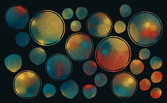](arts/bubbles/bubble-stripe-2.png)
[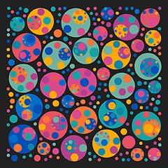](arts/bubbles/bubbub.png)
[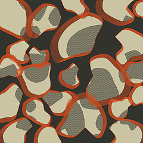](arts/bubbles/pebble1.png)
[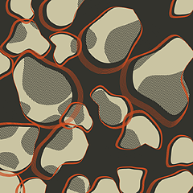](arts/bubbles/pebble2.png)
<br clear="both">

## Cell

[](arts/cell/cell1.png)
<br clear="both">

## Circledots

[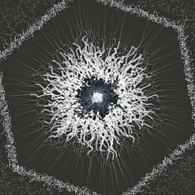](arts/circledots/awaking.png)
[](arts/circledots/circledots.png)
[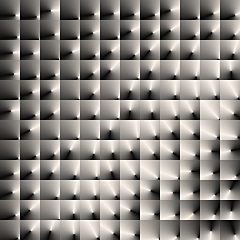](arts/circledots/fbf1.png)
[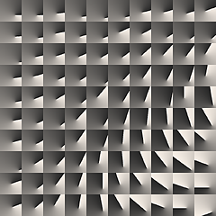](arts/circledots/fbf2.png)
[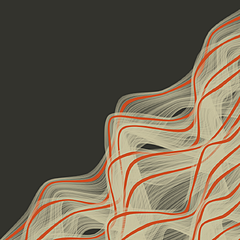](arts/circledots/gentle.png)
[](arts/circledots/guzv.png)
[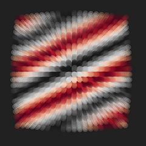](arts/circledots/xy-1.png)
[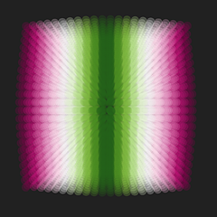](arts/circledots/xy-2.png)
[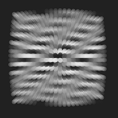](arts/circledots/xy-3.png)
<br clear="both">

## Cotton

[](arts/cotton/cotton-circles2.png)
[](arts/cotton/cotton-circles.png)
[](arts/cotton/cotton1.png)
[](arts/cotton/cotton2.png)
[](arts/cotton/cotton3.png)
<br clear="both">

## Falllines

[](arts/falllines/falllines.png)
<br clear="both">

## Flamebrush

[](arts/flamebrush/flamebrush1.png)
<br clear="both">

## Flowforce

[](arts/flowforce/Eclectic2.png)
[](arts/flowforce/Eclectic.png)
[](arts/flowforce/Eclipse.png)
[](arts/flowforce/Spring.png)
[](arts/flowforce/circlex.png)
[](arts/flowforce/emergence.png)
[](arts/flowforce/flowforce1.png)
[](arts/flowforce/flowforce2.png)
[](arts/flowforce/flowforce3.png)
[](arts/flowforce/flowforce4.png)
[](arts/flowforce/interruption.png)
[](arts/flowforce/vorflow.png)
<br clear="both">

## Harmongraph

[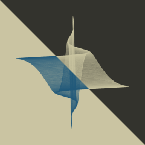](arts/harmongraph/hA.png)
[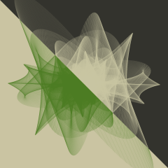](arts/harmongraph/hB.png)
[](arts/harmongraph/hC.png)
[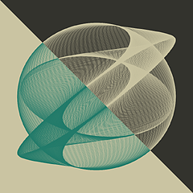](arts/harmongraph/hD.png)
[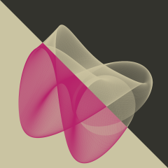](arts/harmongraph/hE.png)
[](arts/harmongraph/hF.png)
[](arts/harmongraph/hG.png)
[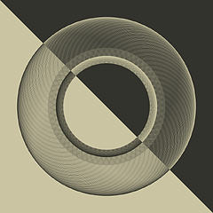](arts/harmongraph/hH.png)
[](arts/harmongraph/harmongraph0.png)
[](arts/harmongraph/harmongraph1.png)
[](arts/harmongraph/harmongraph2.png)
<br clear="both">

## Hills

[](arts/hills/february.png)
[](arts/hills/hills.png)
[](arts/hills/horizons.png)
<br clear="both">

## Igor

[](arts/igor/igor.png)
<br clear="both">

## Joydiv

[](arts/joydiv/joydiv.png)
<br clear="both">

## Kaleiircle

[](arts/kaleiircle/kaleidoscope2-1.png)
[](arts/kaleiircle/kaleidoscope2-2.png)
[](arts/kaleiircle/kaleidoscope2.png)
[](arts/kaleiircle/kaleidoscope3.png)
[](arts/kaleiircle/kaleidoscope.png)
[](arts/kaleiircle/kaleiircle.png)
<br clear="both">

## Legoo

[](arts/legoo/Legoo12.png)
[](arts/legoo/Legoo1.png)
[](arts/legoo/Legoo2.png)
<br clear="both">

## Lettero

[](arts/lettero/LetterO.png)
[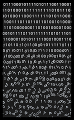](arts/lettero/lettero2.png)
[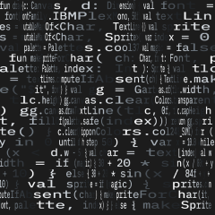](arts/lettero/lettero3-1.png)
[](arts/lettero/lettero3-2.png)
[](arts/lettero/lettero3.png)
<br clear="both">

## Lines

[](arts/lines/citymap.png)
[](arts/lines/heapspace.png)
[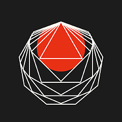](arts/lines/ngons.png)
[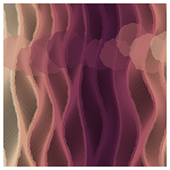](arts/lines/stripes1.png)
[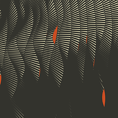](arts/lines/stripes2.png)
[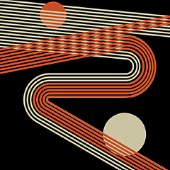](arts/lines/swing2.png)
[](arts/lines/swing3.png)
[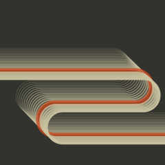](arts/lines/swing.png)
[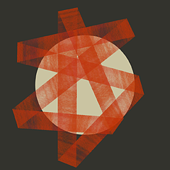](arts/lines/tapesA.png)
[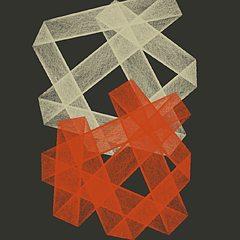](arts/lines/tapesB.png)
[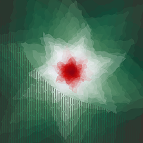](arts/lines/triadance2.png)
[](arts/lines/triangles.png)
[](arts/lines/tridance.png)
<br clear="both">

## Lissajous

[](arts/lissajous/lissajous.png)
[](arts/lissajous/moire.png)
<br clear="both">

## Metro

[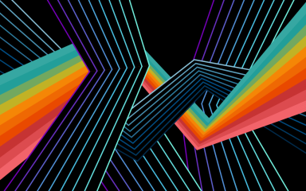](arts/metro/metro2.png)
[](arts/metro/metro.png)
<br clear="both">

## Monet

[](arts/monet/monet1-0.png)
[](arts/monet/monet1.png)
[](arts/monet/monet2.png)
<br clear="both">

## Palecircles

[](arts/palecircles/palecircles.png)
<br clear="both">

## Pixelmania

[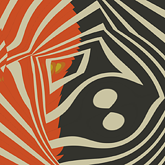](arts/pixelmania/liqf.png)
[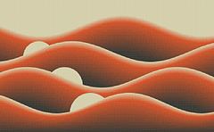](arts/pixelmania/rastersin.png)
[](arts/pixelmania/romb.png)
[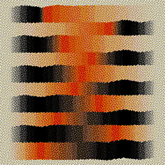](arts/pixelmania/stripo.png)
[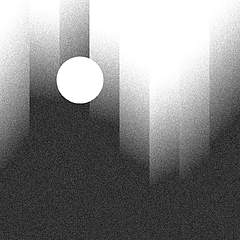](arts/pixelmania/tower01.png)
<br clear="both">

## Plasma

[](arts/plasma/plasma2.png)
[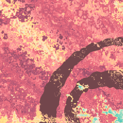](arts/plasma/plasma3.png)
[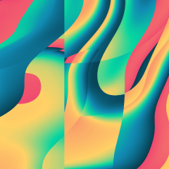](arts/plasma/plasma4.png)
[](arts/plasma/plasma.png)
<br clear="both">

## Rayz

[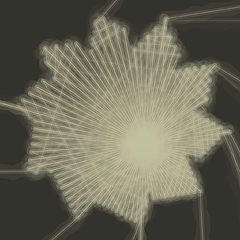](arts/rayz/mirrorz2.png)
[](arts/rayz/mirrorz.png)
[](arts/rayz/rayz2-1.png)
[](arts/rayz/rayz2-2.png)
[](arts/rayz/rayz2-3.png)
[](arts/rayz/rayz.png)
<br clear="both">

## Rectapart

[](arts/rectapart/rectApart.png)
<br clear="both">

## Rects

[](arts/rects/cells.png)
[](arts/rects/divine-divide.png)
[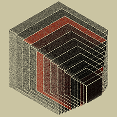](arts/rects/impossible-rubik-one.png)
[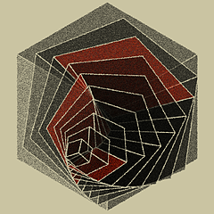](arts/rects/impossible-rubik-three.png)
[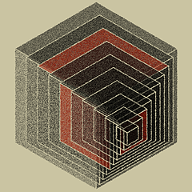](arts/rects/impossible-rubik-two.png)
[](arts/rects/mondrian-01.png)
[](arts/rects/mondrian-02.png)
[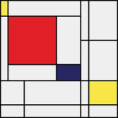](arts/rects/mondrian-03.png)
[](arts/rects/rects-over.png)
[](arts/rects/rects1.png)
[](arts/rects/rects2.png)
<br clear="both">

## Repetition

[](arts/repetition/Repetition1.png)
[](arts/repetition/Repetition2.png)
<br clear="both">

## Rotoro

[](arts/rotoro/rotoro1.png)
[](arts/rotoro/rotoro2-0.png)
[](arts/rotoro/rotoro2-1.png)
[](arts/rotoro/rotoro2-2.png)
[](arts/rotoro/rotoro2.png)
[](arts/rotoro/rotoro3.png)
<br clear="both">

## Roundrects

[](arts/roundrects/roundrects.png)
<br clear="both">

## Rule

[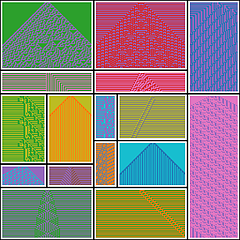](arts/rule/rulez01.png)
[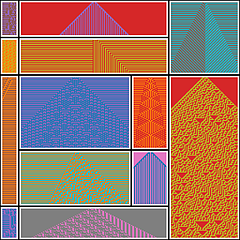](arts/rule/rulez02.png)
<br clear="both">

## Sea

[](arts/sea/sea.png)
<br clear="both">

## Sf

[](arts/sf/sf10.png)
[](arts/sf/sf1.png)
[](arts/sf/sf2.png)
[](arts/sf/sf3.png)
[](arts/sf/sf4.png)
[](arts/sf/sf5.png)
[](arts/sf/sf6.png)
[](arts/sf/sf7.png)
[](arts/sf/sf8.png)
[](arts/sf/sf9.png)
<br clear="both">

## Shad

[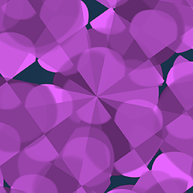](arts/shad/foo.png)
<br clear="both">

## Sixsix

[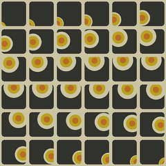](arts/sixsix/moon-over-window.png)
[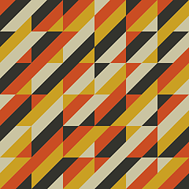](arts/sixsix/six_0.png)
[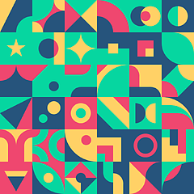](arts/sixsix/sixsix_1.png)
[](arts/sixsix/sixsix_2.png)
<br clear="both">

## Skyscraper

[](arts/skyscraper/skyscraper2.png)
[](arts/skyscraper/skyscraper.png)
<br clear="both">

## Spiral

[](arts/spiral/spiral2.png)
[](arts/spiral/spiral3.png)
[](arts/spiral/spiral.png)
<br clear="both">

## Spirograph

[](arts/spirograph/spirograph1.png)
[](arts/spirograph/spirograph2.png)
<br clear="both">

## Stripes

[](arts/stripes/s2.png)
[](arts/stripes/stripes1.png)
[](arts/stripes/stripes.png)
[](arts/stripes/tolerance.png)
<br clear="both">

## Sun

[](arts/sun/echoes1.png)
[](arts/sun/echoes2.png)
[](arts/sun/sunNS1.png)
[](arts/sun/sunlines.png)
<br clear="both">

## Switchboard

[](arts/switchboard/switchboard.png)
<br clear="both">

## Thre3

[](arts/thre3/noisepads.png)
[](arts/thre3/surfing.png)
<br clear="both">

## Ticktiletock

[](arts/ticktiletock/ticktiletock.png)
<br clear="both">

## Triangular

[](arts/triangular/SaharaDiamond.png)
[](arts/triangular/Triage.png)
<br clear="both">

## Z

[](arts/z/z1.png)
[](arts/z/z2.png)
[](arts/z/z3.png)
[](arts/z/z4.png)
[](arts/z/z5.png)
<br clear="both">

---

**Total: 170 works across 44 collections**
