# gȧrt

🧧 gënérative ȧrt made by pragmatic [kotlin](docs/WhyKotlin.md) micro-framework.

> ❤️ [Instagram](https://www.instagram.com/gart_173) / [Online Gallery](https://igo.rs/gart)
>
> ☕️ [Buy Me a Coffee](https://buymeacoffee.com/oblac) if you like the project.

⭐️ **Gȧrt** is a pragmatical framework and set of utilities for generating and rendering
**still images** and **movies**.

+ uses [Skiko](https://github.com/JetBrains/skiko) (by JetBrains) for [Skia](https://skia.org) binding.
+ `box-2d` for physics simulation.
+ `ffmpeg` for video encoding.

🤷‍♂️ Honestly, I put the framework together for my own needs, so it’s a bit rough around the edges and the naming isn’t
great. _It’s not how I normally write code._

🤖 AI is used mostly to generate comments and documentation.

## ♻️ **Hot Reload**

See [Hot Reload](docs/hotreload.md) for details on how to set up hot reload for faster iteration.

## 🧹 **Sweeper**

See [Sweeper](docs/sweeper.md) for details on how to use the sweeper utility.

## 🚀 Features

See [Features](docs/features.md) for a comprehensive list of features and utilities provided by the framework.

## 🧪 Example

Example folder contains several small projects demonstrating various features of the framework.

+ `Example*` - demonstrations of various features, usually interactive.
+ `Template` - minimal project template to start with.
+ Tools:
  + `GradientGenerator` - interactive gradient palette generator.
  + `FunGraph` - interactive function plotter.

## 🙋‍♀️ Who is using Gȧrt?

+ **Gȧrt** artwork ships as wallpapers in [Smart Launcher](https://www.smartlauncher.net)

(Contact me if you want to be added to this list.)

## 🍭 Gȧlléry

A collection of generative art pieces (ordered by name).

## Alien

<table width="100%">
  <tr>
    <td width="33%" align="center">
      <a href="arts/alien/alien-letters-v1.png">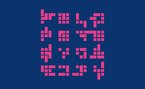</a>
       <b>Alien Letters V1</b>
    </td>
    <td width="33%" align="center">
      <a href="arts/alien/alien-letters-v2.png">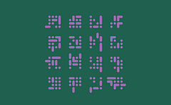</a>
       <b>Alien Letters V2</b>
    </td>
    <td width="33%" align="center">
      <a href="arts/alien/alien-letters-v3.png">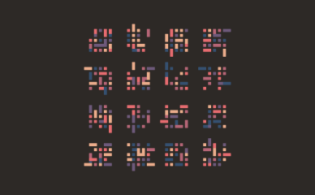</a>
       <b>Alien Letters V3</b>
    </td>
  </tr>
  <tr>
    <td width="33%" align="center">
      <a href="arts/alien/alien2.png">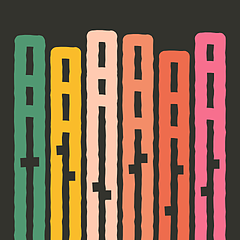</a>
       <b>Alien2</b>
    </td>
    <td width="33%"></td>
    <td width="33%"></td>
  </tr>
</table>

## Blob

<table width="100%">
  <tr>
    <td width="33%" align="center">
      <a href="arts/blob/blob.jpg">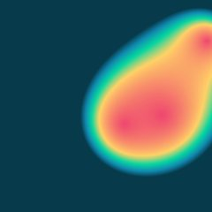</a>
       <b>Blob</b>
    </td>
    <td width="33%"></td>
    <td width="33%"></td>
  </tr>
</table>

## Bubbles

<table width="100%">
  <tr>
    <td width="33%" align="center">
      <a href="arts/bubbles/BubbleStripe.png">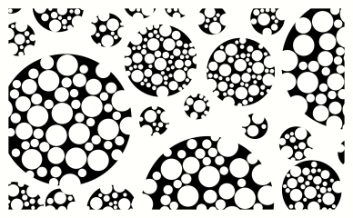</a>
       <b>BubbleStripe</b>
    </td>
    <td width="33%" align="center">
      <a href="arts/bubbles/Bubbles2.png">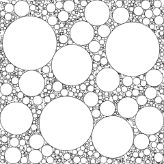</a>
       <b>Bubbles2</b>
    </td>
    <td width="33%" align="center">
      
       <b>Bubble Stripe 2</b>
    </td>
  </tr>
  <tr>
    <td width="33%" align="center">
      <a href="arts/bubbles/bubbub.png">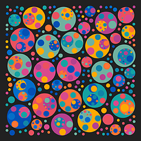</a>
       <b>Bubbub</b>
    </td>
    <td width="33%" align="center">
      <a href="arts/bubbles/holes.png">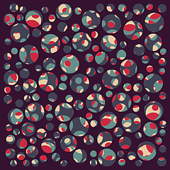</a>
       <b>Holes</b>
    </td>
    <td width="33%" align="center">
      <a href="arts/bubbles/pebble1.png">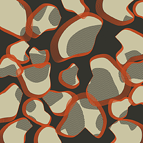</a>
       <b>Pebble1</b>
    </td>
  </tr>
  <tr>
    <td width="33%" align="center">
      <a href="arts/bubbles/pebble2.png">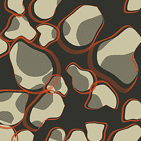</a>
       <b>Pebble2</b>
    </td>
    <td width="33%" align="center">
      <a href="arts/bubbles/pinna.png">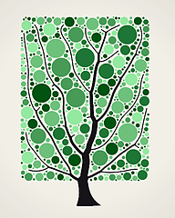</a>
       <b>Pinna</b>
    </td>
    <td width="33%"></td>
  </tr>
</table>

## Cell

<table width="100%">
  <tr>
    <td width="33%" align="center">
      <a href="arts/cell/accertion_d_s7_g145.png">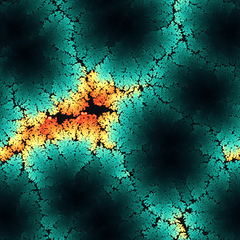</a>
       <b>Accertion D S7 G145</b>
    </td>
    <td width="33%" align="center">
      <a href="arts/cell/accretion.png">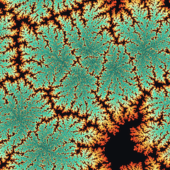</a>
       <b>Accretion</b>
    </td>
    <td width="33%" align="center">
      <a href="arts/cell/areola.png">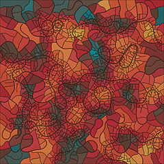</a>
       <b>Areola</b>
    </td>
  </tr>
  <tr>
    <td width="33%" align="center">
      <a href="arts/cell/cell1.png">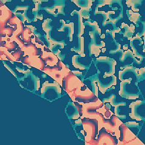</a>
       <b>Cell1</b>
    </td>
    <td width="33%" align="center">
      <a href="arts/cell/cell2.png">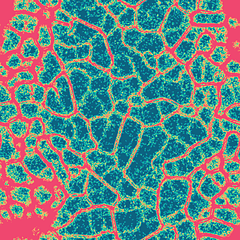</a>
       <b>Cell2</b>
    </td>
    <td width="33%" align="center">
      <a href="arts/cell/crista.png">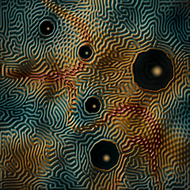</a>
       <b>Crista</b>
    </td>
  </tr>
  <tr>
    <td width="33%" align="center">
      <a href="arts/cell/nervure.png">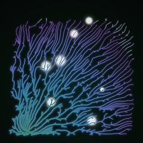</a>
       <b>Nervure</b>
    </td>
    <td width="33%" align="center">
      <a href="arts/cell/rugae.png">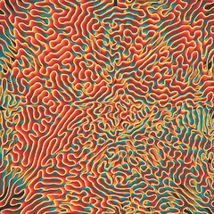</a>
       <b>Rugae</b>
    </td>
    <td width="33%"></td>
  </tr>
</table>

## Circledots

<table width="100%">
  <tr>
    <td width="33%" align="center">
      <a href="arts/circledots/awaking.png">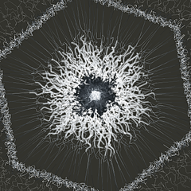</a>
       <b>Awaking</b>
    </td>
    <td width="33%" align="center">
      <a href="arts/circledots/circledots.png">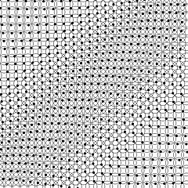</a>
       <b>Circledots</b>
    </td>
    <td width="33%" align="center">
      <a href="arts/circledots/fbf1.png">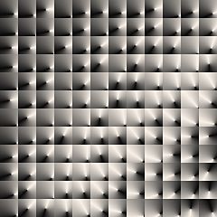</a>
       <b>Fbf1</b>
    </td>
  </tr>
  <tr>
    <td width="33%" align="center">
      <a href="arts/circledots/fbf2.png">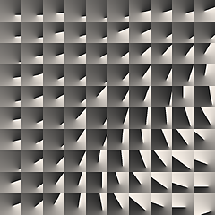</a>
       <b>Fbf2</b>
    </td>
    <td width="33%" align="center">
      <a href="arts/circledots/gentle.png">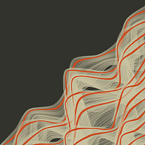</a>
       <b>Gentle</b>
    </td>
    <td width="33%" align="center">
      
       <b>Guzv</b>
    </td>
  </tr>
  <tr>
    <td width="33%" align="center">
      <a href="arts/circledots/xy-1.png">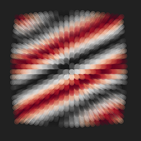</a>
       <b>Xy 1</b>
    </td>
    <td width="33%" align="center">
      <a href="arts/circledots/xy-2.png">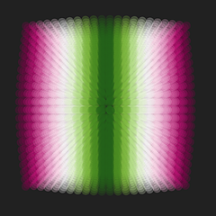</a>
       <b>Xy 2</b>
    </td>
    <td width="33%" align="center">
      <a href="arts/circledots/xy-3.png">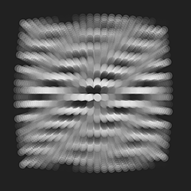</a>
       <b>Xy 3</b>
    </td>
  </tr>
</table>

## Cotton

<table width="100%">
  <tr>
    <td width="33%" align="center">
      <a href="arts/cotton/cotton-circles2.png">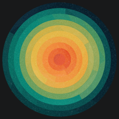</a>
       <b>Cotton Circles2</b>
    </td>
    <td width="33%" align="center">
      
       <b>Cotton Circles</b>
    </td>
    <td width="33%" align="center">
      <a href="arts/cotton/cotton1.png">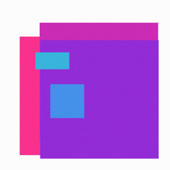</a>
       <b>Cotton1</b>
    </td>
  </tr>
  <tr>
    <td width="33%" align="center">
      <a href="arts/cotton/cotton2.png">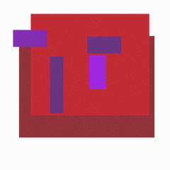</a>
       <b>Cotton2</b>
    </td>
    <td width="33%" align="center">
      <a href="arts/cotton/cotton3.png">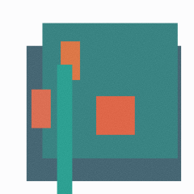</a>
       <b>Cotton3</b>
    </td>
    <td width="33%"></td>
  </tr>
</table>

## Falllines

<table width="100%">
  <tr>
    <td width="33%" align="center">
      <a href="arts/falllines/falllines.png">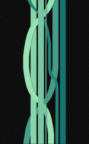</a>
       <b>Falllines</b>
    </td>
    <td width="33%"></td>
    <td width="33%"></td>
  </tr>
</table>

## Flamebrush

<table width="100%">
  <tr>
    <td width="33%" align="center">
      
       <b>Flamebrush1</b>
    </td>
    <td width="33%"></td>
    <td width="33%"></td>
  </tr>
</table>

## Flowforce

<table width="100%">
  <tr>
    <td width="33%" align="center">
      <a href="arts/flowforce/Eclectic2.png">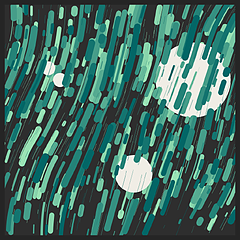</a>
       <b>Eclectic2</b>
    </td>
    <td width="33%" align="center">
      <a href="arts/flowforce/Eclectic.png">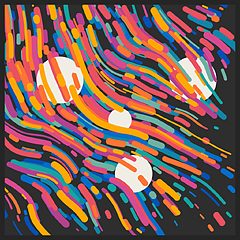</a>
       <b>Eclectic</b>
    </td>
    <td width="33%" align="center">
      <a href="arts/flowforce/Eclipse.png">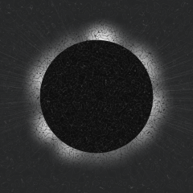</a>
       <b>Eclipse</b>
    </td>
  </tr>
  <tr>
    <td width="33%" align="center">
      <a href="arts/flowforce/Spring.png">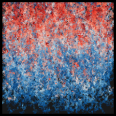</a>
       <b>Spring</b>
    </td>
    <td width="33%" align="center">
      <a href="arts/flowforce/broke.png">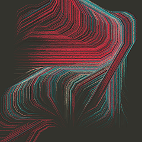</a>
       <b>Broke</b>
    </td>
    <td width="33%" align="center">
      
       <b>Circlex</b>
    </td>
  </tr>
  <tr>
    <td width="33%" align="center">
      <a href="arts/flowforce/cyanowaves.png">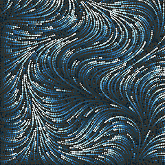</a>
       <b>Cyanowaves</b>
    </td>
    <td width="33%" align="center">
      <a href="arts/flowforce/emergence.png">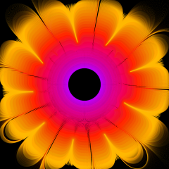</a>
       <b>Emergence</b>
    </td>
    <td width="33%" align="center">
      
       <b>Fire</b>
    </td>
  </tr>
  <tr>
    <td width="33%" align="center">
      
       <b>Flow10</b>
    </td>
    <td width="33%" align="center">
      <a href="arts/flowforce/flowforce1.png">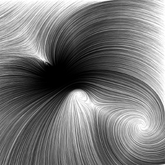</a>
       <b>Flowforce1</b>
    </td>
    <td width="33%" align="center">
      <a href="arts/flowforce/flowforce2.png">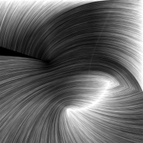</a>
       <b>Flowforce2</b>
    </td>
  </tr>
  <tr>
    <td width="33%" align="center">
      <a href="arts/flowforce/flowforce3.png">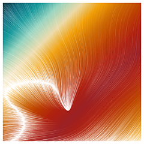</a>
       <b>Flowforce3</b>
    </td>
    <td width="33%" align="center">
      <a href="arts/flowforce/flowforce4.png">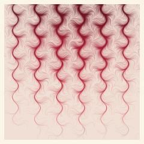</a>
       <b>Flowforce4</b>
    </td>
    <td width="33%" align="center">
      
       <b>Glst1</b>
    </td>
  </tr>
  <tr>
    <td width="33%" align="center">
      
       <b>Glst2</b>
    </td>
    <td width="33%" align="center">
      <a href="arts/flowforce/interruption.png">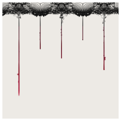</a>
       <b>Interruption</b>
    </td>
    <td width="33%" align="center">
      
       <b>Monolith</b>
    </td>
  </tr>
  <tr>
    <td width="33%" align="center">
      <a href="arts/flowforce/orb1.png">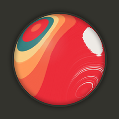</a>
       <b>Orb1</b>
    </td>
    <td width="33%" align="center">
      <a href="arts/flowforce/orb2.png">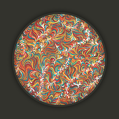</a>
       <b>Orb2</b>
    </td>
    <td width="33%" align="center">
      
       <b>Orb3 1</b>
    </td>
  </tr>
  <tr>
    <td width="33%" align="center">
      
       <b>Orb3 2</b>
    </td>
    <td width="33%" align="center">
      <a href="arts/flowforce/perl_1.png">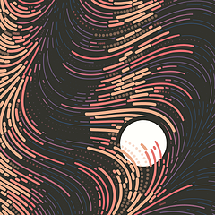</a>
       <b>Perl 1</b>
    </td>
    <td width="33%" align="center">
      <a href="arts/flowforce/perl.png">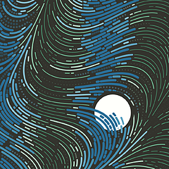</a>
       <b>Perl</b>
    </td>
  </tr>
  <tr>
    <td width="33%" align="center">
      <a href="arts/flowforce/vivipard.png">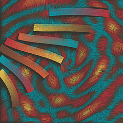</a>
       <b>Vivipard</b>
    </td>
    <td width="33%" align="center">
      <a href="arts/flowforce/vorflow.png">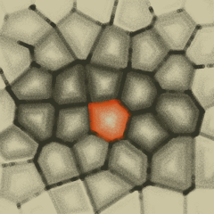</a>
       <b>Vorflow</b>
    </td>
    <td width="33%" align="center">
      
       <b>Worms</b>
    </td>
  </tr>
</table>

## Fluid

<table width="100%">
  <tr>
    <td width="33%" align="center">
      <a href="arts/fluid/fluid-pack.png">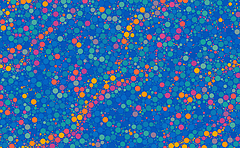</a>
       <b>Fluid Pack</b>
    </td>
    <td width="33%" align="center">
      <a href="arts/fluid/fluid-wind.png">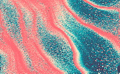</a>
       <b>Fluid Wind</b>
    </td>
    <td width="33%"></td>
  </tr>
</table>

## Harmongraph

<table width="100%">
  <tr>
    <td width="33%" align="center">
      <a href="arts/harmongraph/hA.png">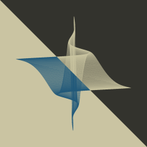</a>
       <b>HA</b>
    </td>
    <td width="33%" align="center">
      <a href="arts/harmongraph/hB.png">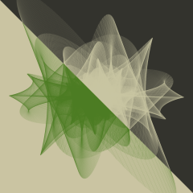</a>
       <b>HB</b>
    </td>
    <td width="33%" align="center">
      <a href="arts/harmongraph/hC.png">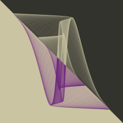</a>
       <b>HC</b>
    </td>
  </tr>
  <tr>
    <td width="33%" align="center">
      <a href="arts/harmongraph/hD.png">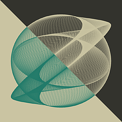</a>
       <b>HD</b>
    </td>
    <td width="33%" align="center">
      <a href="arts/harmongraph/hE.png">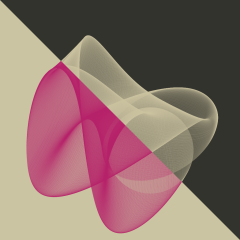</a>
       <b>HE</b>
    </td>
    <td width="33%" align="center">
      <a href="arts/harmongraph/hF.png">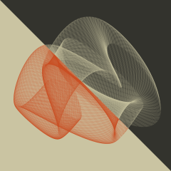</a>
       <b>HF</b>
    </td>
  </tr>
  <tr>
    <td width="33%" align="center">
      <a href="arts/harmongraph/hG.png">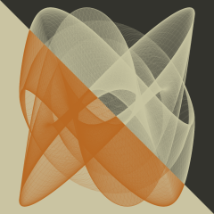</a>
       <b>HG</b>
    </td>
    <td width="33%" align="center">
      
       <b>HH</b>
    </td>
    <td width="33%" align="center">
      <a href="arts/harmongraph/harmongraph0.png">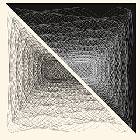</a>
       <b>Harmongraph0</b>
    </td>
  </tr>
  <tr>
    <td width="33%" align="center">
      <a href="arts/harmongraph/harmongraph1.png">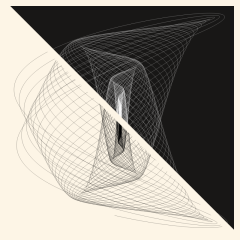</a>
       <b>Harmongraph1</b>
    </td>
    <td width="33%" align="center">
      <a href="arts/harmongraph/harmongraph2.png">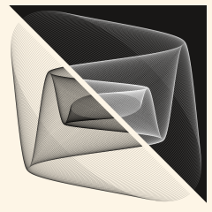</a>
       <b>Harmongraph2</b>
    </td>
    <td width="33%"></td>
  </tr>
</table>

## Hills

<table width="100%">
  <tr>
    <td width="33%" align="center">
      
       <b>February</b>
    </td>
    <td width="33%" align="center">
      <a href="arts/hills/hills.png">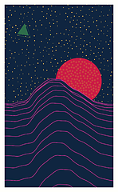</a>
       <b>Hills</b>
    </td>
    <td width="33%" align="center">
      
       <b>Horizons</b>
    </td>
  </tr>
</table>

## Igor

<table width="100%">
  <tr>
    <td width="33%" align="center">
      <a href="arts/igor/igor.png">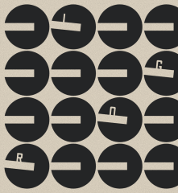</a>
       <b>Igor</b>
    </td>
    <td width="33%"></td>
    <td width="33%"></td>
  </tr>
</table>

## Joydiv

<table width="100%">
  <tr>
    <td width="33%" align="center">
      <a href="arts/joydiv/joydiv.png">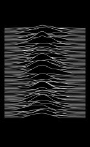</a>
       <b>Joydiv</b>
    </td>
    <td width="33%"></td>
    <td width="33%"></td>
  </tr>
</table>

## Kaleiircle

<table width="100%">
  <tr>
    <td width="33%" align="center">
      
       <b>Kaleidoscope2 1</b>
    </td>
    <td width="33%" align="center">
      <a href="arts/kaleiircle/kaleidoscope2-2.png">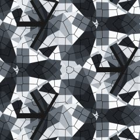</a>
       <b>Kaleidoscope2 2</b>
    </td>
    <td width="33%" align="center">
      <a href="arts/kaleiircle/kaleidoscope2.png">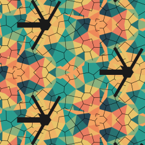</a>
       <b>Kaleidoscope2</b>
    </td>
  </tr>
  <tr>
    <td width="33%" align="center">
      <a href="arts/kaleiircle/kaleidoscope3.png">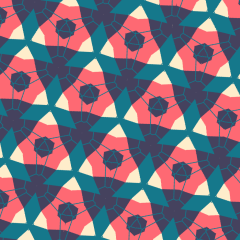</a>
       <b>Kaleidoscope3</b>
    </td>
    <td width="33%" align="center">
      
       <b>Kaleidoscope</b>
    </td>
    <td width="33%" align="center">
      <a href="arts/kaleiircle/kaleiircle.png">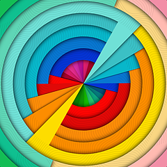</a>
       <b>Kaleiircle</b>
    </td>
  </tr>
</table>

## Layers

<table width="100%">
  <tr>
    <td width="33%" align="center">
      <a href="arts/layers/plica.png">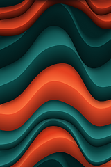</a>
       <b>Plica</b>
    </td>
    <td width="33%" align="center">
      
       <b>Relief2</b>
    </td>
    <td width="33%" align="center">
      <a href="arts/layers/relief.png">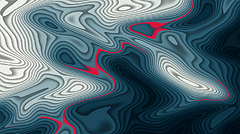</a>
       <b>Relief</b>
    </td>
  </tr>
  <tr>
    <td width="33%" align="center">
      
       <b>Sabulum</b>
    </td>
    <td width="33%" align="center">
      
       <b>Strata</b>
    </td>
    <td width="33%" align="center">
      
       <b>Undula</b>
    </td>
  </tr>
</table>

## Legoo

<table width="100%">
  <tr>
    <td width="33%" align="center">
      <a href="arts/legoo/Legoo12.png">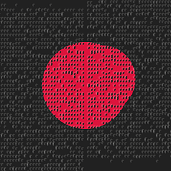</a>
       <b>Legoo12</b>
    </td>
    <td width="33%" align="center">
      <a href="arts/legoo/Legoo1.png">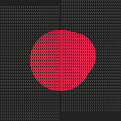</a>
       <b>Legoo1</b>
    </td>
    <td width="33%" align="center">
      
       <b>Legoo2</b>
    </td>
  </tr>
</table>

## Lettero

<table width="100%">
  <tr>
    <td width="33%" align="center">
      <a href="arts/lettero/LetterO.png">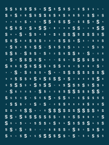</a>
       <b>LetterO</b>
    </td>
    <td width="33%" align="center">
      <a href="arts/lettero/alpha-stripes.png">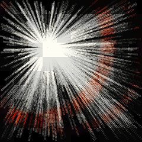</a>
       <b>Alpha Stripes</b>
    </td>
    <td width="33%" align="center">
      <a href="arts/lettero/lettero2.png">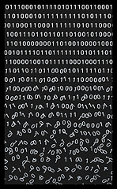</a>
       <b>Lettero2</b>
    </td>
  </tr>
  <tr>
    <td width="33%" align="center">
      <a href="arts/lettero/lettero3-1.png">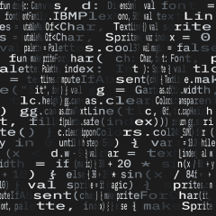</a>
       <b>Lettero3 1</b>
    </td>
    <td width="33%" align="center">
      <a href="arts/lettero/lettero3-2.png">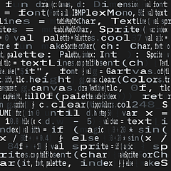</a>
       <b>Lettero3 2</b>
    </td>
    <td width="33%" align="center">
      <a href="arts/lettero/lettero3.png">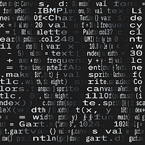</a>
       <b>Lettero3</b>
    </td>
  </tr>
  <tr>
    <td width="33%" align="center">
      
       <b>Turgor</b>
    </td>
    <td width="33%"></td>
    <td width="33%"></td>
  </tr>
</table>

## Lines

<table width="100%">
  <tr>
    <td width="33%" align="center">
      <a href="arts/lines/boks.png">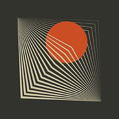</a>
       <b>Boks</b>
    </td>
    <td width="33%" align="center">
      <a href="arts/lines/citymap.png">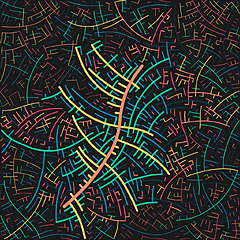</a>
       <b>Citymap</b>
    </td>
    <td width="33%" align="center">
      <a href="arts/lines/growth2.png">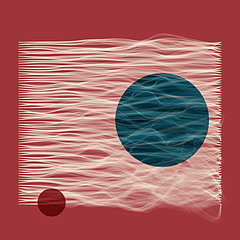</a>
       <b>Growth2</b>
    </td>
  </tr>
  <tr>
    <td width="33%" align="center">
      <a href="arts/lines/growth3.png">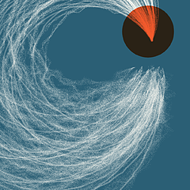</a>
       <b>Growth3</b>
    </td>
    <td width="33%" align="center">
      <a href="arts/lines/growth.png">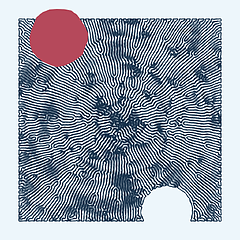</a>
       <b>Growth</b>
    </td>
    <td width="33%" align="center">
      
       <b>Heapspace</b>
    </td>
  </tr>
  <tr>
    <td width="33%" align="center">
      
       <b>Ngons</b>
    </td>
    <td width="33%" align="center">
      <a href="arts/lines/nocube.png">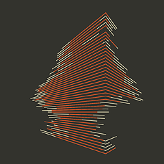</a>
       <b>Nocube</b>
    </td>
    <td width="33%" align="center">
      <a href="arts/lines/outline.png">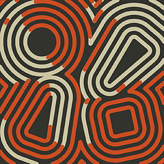</a>
       <b>Outline</b>
    </td>
  </tr>
  <tr>
    <td width="33%" align="center">
      <a href="arts/lines/stripes1.png">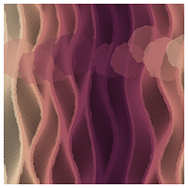</a>
       <b>Stripes1</b>
    </td>
    <td width="33%" align="center">
      
       <b>Stripes2</b>
    </td>
    <td width="33%" align="center">
      <a href="arts/lines/swing2.png">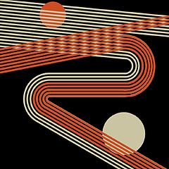</a>
       <b>Swing2</b>
    </td>
  </tr>
  <tr>
    <td width="33%" align="center">
      <a href="arts/lines/swing3.png">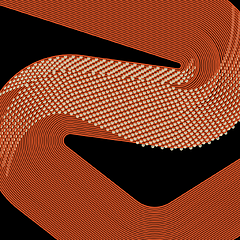</a>
       <b>Swing3</b>
    </td>
    <td width="33%" align="center">
      <a href="arts/lines/swing.png">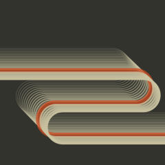</a>
       <b>Swing</b>
    </td>
    <td width="33%" align="center">
      
       <b>TapesA</b>
    </td>
  </tr>
  <tr>
    <td width="33%" align="center">
      <a href="arts/lines/tapesB.png">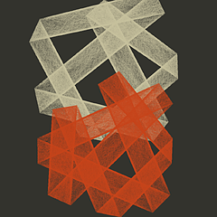</a>
       <b>TapesB</b>
    </td>
    <td width="33%" align="center">
      <a href="arts/lines/triadance2.png">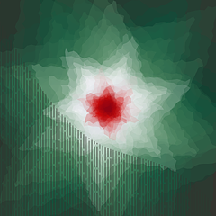</a>
       <b>Triadance2</b>
    </td>
    <td width="33%" align="center">
      <a href="arts/lines/triangles.png">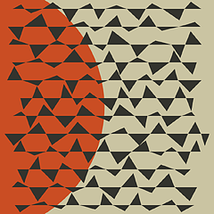</a>
       <b>Triangles</b>
    </td>
  </tr>
  <tr>
    <td width="33%" align="center">
      <a href="arts/lines/tridance.png">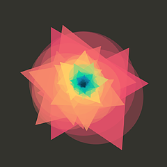</a>
       <b>Tridance</b>
    </td>
    <td width="33%" align="center">
      <a href="arts/lines/vitrall.png">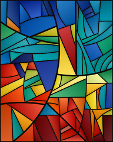</a>
       <b>Vitrall</b>
    </td>
    <td width="33%"></td>
  </tr>
</table>

## Lissajous

<table width="100%">
  <tr>
    <td width="33%" align="center">
      <a href="arts/lissajous/lissajous.png">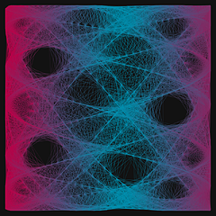</a>
       <b>Lissajous</b>
    </td>
    <td width="33%" align="center">
      
       <b>Moire</b>
    </td>
    <td width="33%"></td>
  </tr>
</table>

## Mathy

<table width="100%">
  <tr>
    <td width="33%" align="center">
      <a href="arts/mathy/corona.png">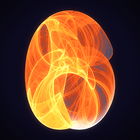</a>
       <b>Corona</b>
    </td>
    <td width="33%"></td>
    <td width="33%"></td>
  </tr>
</table>

## Metro

<table width="100%">
  <tr>
    <td width="33%" align="center">
      
       <b>Metro2</b>
    </td>
    <td width="33%" align="center">
      
       <b>Metro</b>
    </td>
    <td width="33%"></td>
  </tr>
</table>

## Monet

<table width="100%">
  <tr>
    <td width="33%" align="center">
      <a href="arts/monet/monet1-0.png">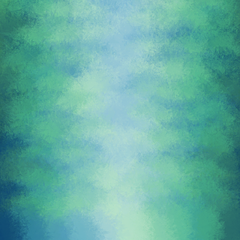</a>
       <b>Monet1 0</b>
    </td>
    <td width="33%" align="center">
      
       <b>Monet1</b>
    </td>
    <td width="33%" align="center">
      <a href="arts/monet/monet2.png">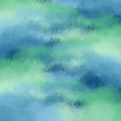</a>
       <b>Monet2</b>
    </td>
  </tr>
</table>

## Neuromancer

<table width="100%">
  <tr>
    <td width="33%" align="center">
      
       <b>Nm1</b>
    </td>
    <td width="33%"></td>
    <td width="33%"></td>
  </tr>
</table>

## Orbitr

<table width="100%">
  <tr>
    <td width="33%" align="center">
      <a href="arts/orbitr/12monkeys.png">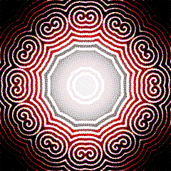</a>
       <b>12monkeys</b>
    </td>
    <td width="33%" align="center">
      <a href="arts/orbitr/orbitr.png">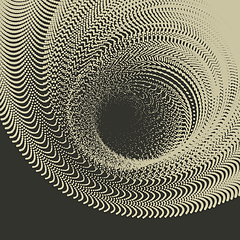</a>
       <b>Orbitr</b>
    </td>
    <td width="33%" align="center">
      <a href="arts/orbitr/triangle-in-space.png">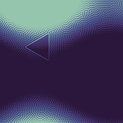</a>
       <b>Triangle In Space</b>
    </td>
  </tr>
</table>

## Palecircles

<table width="100%">
  <tr>
    <td width="33%" align="center">
      <a href="arts/palecircles/all-circles.png">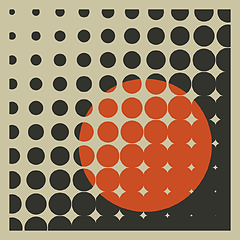</a>
       <b>All Circles</b>
    </td>
    <td width="33%" align="center">
      
       <b>Around</b>
    </td>
    <td width="33%" align="center">
      <a href="arts/palecircles/palecircles.png">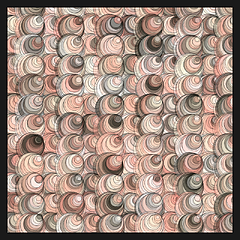</a>
       <b>Palecircles</b>
    </td>
  </tr>
  <tr>
    <td width="33%" align="center">
      <a href="arts/palecircles/shad.png">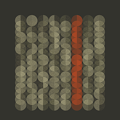</a>
       <b>Shad</b>
    </td>
    <td width="33%"></td>
    <td width="33%"></td>
  </tr>
</table>

## Pixelmania

<table width="100%">
  <tr>
    <td width="33%" align="center">
      
       <b>Circl</b>
    </td>
    <td width="33%" align="center">
      <a href="arts/pixelmania/cosmic.png">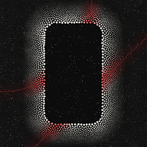</a>
       <b>Cosmic</b>
    </td>
    <td width="33%" align="center">
      <a href="arts/pixelmania/flight.png">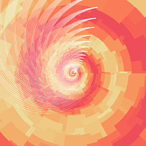</a>
       <b>Flight</b>
    </td>
  </tr>
  <tr>
    <td width="33%" align="center">
      
       <b>Glass</b>
    </td>
    <td width="33%" align="center">
      
       <b>Liqf</b>
    </td>
    <td width="33%" align="center">
      <a href="arts/pixelmania/nippon.png">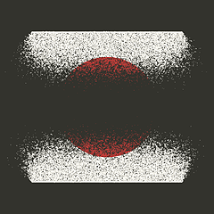</a>
       <b>Nippon</b>
    </td>
  </tr>
  <tr>
    <td width="33%" align="center">
      <a href="arts/pixelmania/rastersin.png">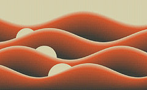</a>
       <b>Rastersin</b>
    </td>
    <td width="33%" align="center">
      <a href="arts/pixelmania/romb.png">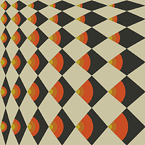</a>
       <b>Romb</b>
    </td>
    <td width="33%" align="center">
      <a href="arts/pixelmania/stripo.png">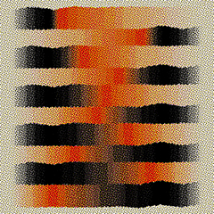</a>
       <b>Stripo</b>
    </td>
  </tr>
  <tr>
    <td width="33%" align="center">
      
       <b>Tower01</b>
    </td>
    <td width="33%" align="center">
      <a href="arts/pixelmania/waves-bw.png">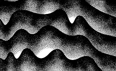</a>
       <b>Waves Bw</b>
    </td>
    <td width="33%" align="center">
      <a href="arts/pixelmania/waves.png">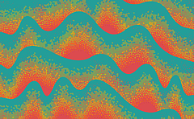</a>
       <b>Waves</b>
    </td>
  </tr>
</table>

## Plasma

<table width="100%">
  <tr>
    <td width="33%" align="center">
      <a href="arts/plasma/plasma2.png">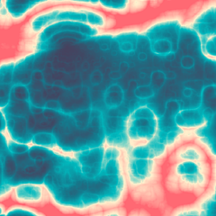</a>
       <b>Plasma2</b>
    </td>
    <td width="33%" align="center">
      
       <b>Plasma3</b>
    </td>
    <td width="33%" align="center">
      
       <b>Plasma4</b>
    </td>
  </tr>
  <tr>
    <td width="33%" align="center">
      <a href="arts/plasma/plasma.png">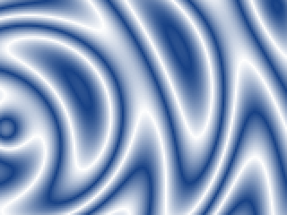</a>
       <b>Plasma</b>
    </td>
    <td width="33%" align="center">
      <a href="arts/plasma/plasmeander.png">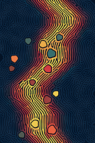</a>
       <b>Plasmeander</b>
    </td>
    <td width="33%"></td>
  </tr>
</table>

## Rayz

<table width="100%">
  <tr>
    <td width="33%" align="center">
      <a href="arts/rayz/mirr.png">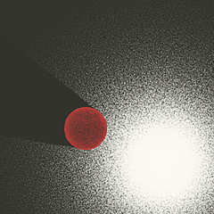</a>
       <b>Mirr</b>
    </td>
    <td width="33%" align="center">
      <a href="arts/rayz/mirrorz2.png">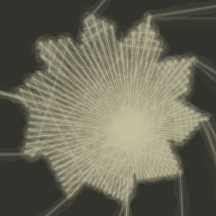</a>
       <b>Mirrorz2</b>
    </td>
    <td width="33%" align="center">
      <a href="arts/rayz/mirrorz.png">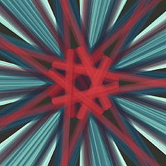</a>
       <b>Mirrorz</b>
    </td>
  </tr>
  <tr>
    <td width="33%" align="center">
      
       <b>Rayz2 1</b>
    </td>
    <td width="33%" align="center">
      
       <b>Rayz2 2</b>
    </td>
    <td width="33%" align="center">
      <a href="arts/rayz/rayz2-3.png">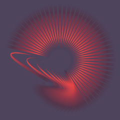</a>
       <b>Rayz2 3</b>
    </td>
  </tr>
  <tr>
    <td width="33%" align="center">
      <a href="arts/rayz/rayz.png">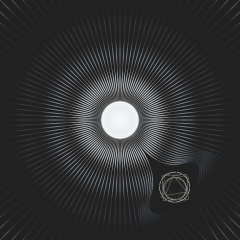</a>
       <b>Rayz</b>
    </td>
    <td width="33%"></td>
    <td width="33%"></td>
  </tr>
</table>

## Rectapart

<table width="100%">
  <tr>
    <td width="33%" align="center">
      
       <b>Fall Squares</b>
    </td>
    <td width="33%" align="center">
      <a href="arts/rectapart/rectApart.png">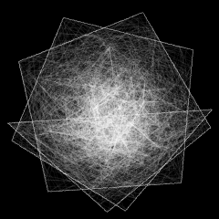</a>
       <b>RectApart</b>
    </td>
    <td width="33%" align="center">
      
       <b>Rectapart3</b>
    </td>
  </tr>
  <tr>
    <td width="33%" align="center">
      <a href="arts/rectapart/rectaround.png">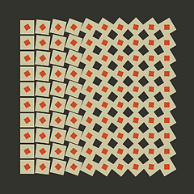</a>
       <b>Rectaround</b>
    </td>
    <td width="33%" align="center">
      
       <b>Rectpack1</b>
    </td>
    <td width="33%" align="center">
      
       <b>Rectpack2</b>
    </td>
  </tr>
</table>

## Rects

<table width="100%">
  <tr>
    <td width="33%" align="center">
      
       <b>Butterfly</b>
    </td>
    <td width="33%" align="center">
      <a href="arts/rects/cells.png">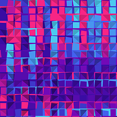</a>
       <b>Cells</b>
    </td>
    <td width="33%" align="center">
      <a href="arts/rects/divine-divide.png">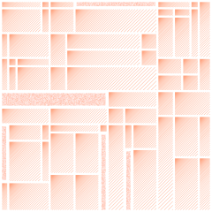</a>
       <b>Divine Divide</b>
    </td>
  </tr>
  <tr>
    <td width="33%" align="center">
      <a href="arts/rects/impossible-rubik-one.png">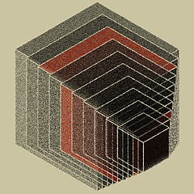</a>
       <b>Impossible Rubik One</b>
    </td>
    <td width="33%" align="center">
      <a href="arts/rects/impossible-rubik-three.png">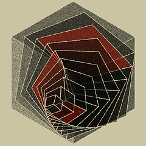</a>
       <b>Impossible Rubik Three</b>
    </td>
    <td width="33%" align="center">
      <a href="arts/rects/impossible-rubik-two.png">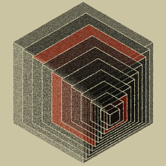</a>
       <b>Impossible Rubik Two</b>
    </td>
  </tr>
  <tr>
    <td width="33%" align="center">
      <a href="arts/rects/mondrian-01.png">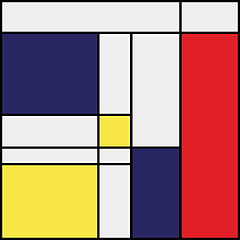</a>
       <b>Mondrian 01</b>
    </td>
    <td width="33%" align="center">
      <a href="arts/rects/mondrian-02.png">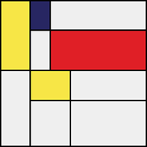</a>
       <b>Mondrian 02</b>
    </td>
    <td width="33%" align="center">
      <a href="arts/rects/mondrian-03.png">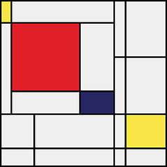</a>
       <b>Mondrian 03</b>
    </td>
  </tr>
  <tr>
    <td width="33%" align="center">
      <a href="arts/rects/rects-over.png">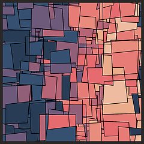</a>
       <b>Rects Over</b>
    </td>
    <td width="33%" align="center">
      
       <b>Rects1</b>
    </td>
    <td width="33%" align="center">
      <a href="arts/rects/rects2.png">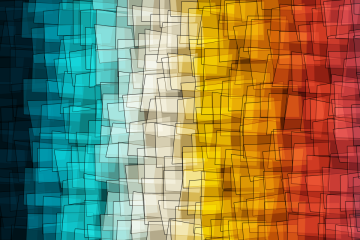</a>
       <b>Rects2</b>
    </td>
  </tr>
</table>

## Repetition

<table width="100%">
  <tr>
    <td width="33%" align="center">
      <a href="arts/repetition/Repetition1.png">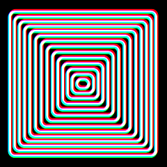</a>
       <b>Repetition1</b>
    </td>
    <td width="33%" align="center">
      
       <b>Repetition2</b>
    </td>
    <td width="33%"></td>
  </tr>
</table>

## Rotoro

<table width="100%">
  <tr>
    <td width="33%" align="center">
      <a href="arts/rotoro/rotoro1.png">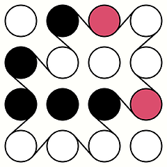</a>
       <b>Rotoro1</b>
    </td>
    <td width="33%" align="center">
      
       <b>Rotoro2 0</b>
    </td>
    <td width="33%" align="center">
      
       <b>Rotoro2 1</b>
    </td>
  </tr>
  <tr>
    <td width="33%" align="center">
      
       <b>Rotoro2 2</b>
    </td>
    <td width="33%" align="center">
      <a href="arts/rotoro/rotoro2.png">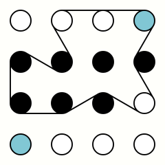</a>
       <b>Rotoro2</b>
    </td>
    <td width="33%" align="center">
      <a href="arts/rotoro/rotoro3.png">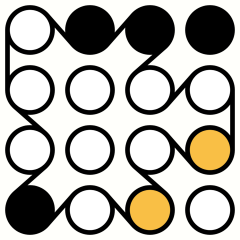</a>
       <b>Rotoro3</b>
    </td>
  </tr>
</table>

## Roundrects

<table width="100%">
  <tr>
    <td width="33%" align="center">
      <a href="arts/roundrects/roundrects.png">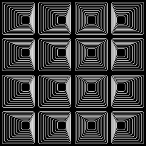</a>
       <b>Roundrects</b>
    </td>
    <td width="33%"></td>
    <td width="33%"></td>
  </tr>
</table>

## Rule

<table width="100%">
  <tr>
    <td width="33%" align="center">
      <a href="arts/rule/rulez01.png">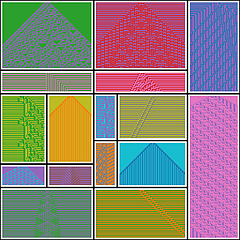</a>
       <b>Rulez01</b>
    </td>
    <td width="33%" align="center">
      <a href="arts/rule/rulez02.png">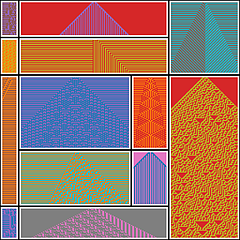</a>
       <b>Rulez02</b>
    </td>
    <td width="33%"></td>
  </tr>
</table>

## Sea

<table width="100%">
  <tr>
    <td width="33%" align="center">
      
       <b>Sea</b>
    </td>
    <td width="33%"></td>
    <td width="33%"></td>
  </tr>
</table>

## Sf

<table width="100%">
  <tr>
    <td width="33%" align="center">
      <a href="arts/sf/sf10.png">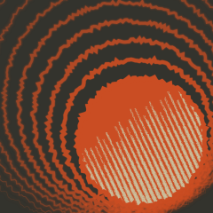</a>
       <b>Sf10</b>
    </td>
    <td width="33%" align="center">
      <a href="arts/sf/sf11-a.png">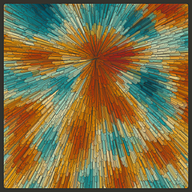</a>
       <b>Sf11 A</b>
    </td>
    <td width="33%" align="center">
      <a href="arts/sf/sf11-b.png">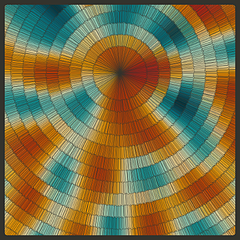</a>
       <b>Sf11 B</b>
    </td>
  </tr>
  <tr>
    <td width="33%" align="center">
      
       <b>Sf1</b>
    </td>
    <td width="33%" align="center">
      <a href="arts/sf/sf2.png">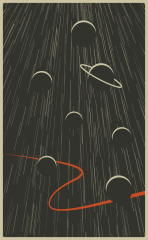</a>
       <b>Sf2</b>
    </td>
    <td width="33%" align="center">
      <a href="arts/sf/sf3.png">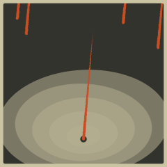</a>
       <b>Sf3</b>
    </td>
  </tr>
  <tr>
    <td width="33%" align="center">
      
       <b>Sf4</b>
    </td>
    <td width="33%" align="center">
      <a href="arts/sf/sf5.png">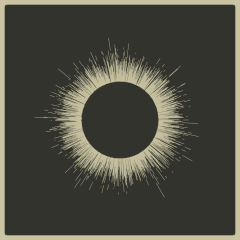</a>
       <b>Sf5</b>
    </td>
    <td width="33%" align="center">
      <a href="arts/sf/sf6.png">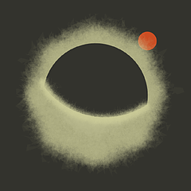</a>
       <b>Sf6</b>
    </td>
  </tr>
  <tr>
    <td width="33%" align="center">
      <a href="arts/sf/sf7.png">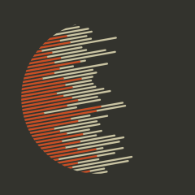</a>
       <b>Sf7</b>
    </td>
    <td width="33%" align="center">
      
       <b>Sf8</b>
    </td>
    <td width="33%" align="center">
      <a href="arts/sf/sf9.png">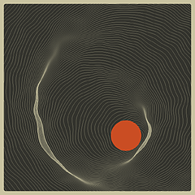</a>
       <b>Sf9</b>
    </td>
  </tr>
</table>

## Shad

<table width="100%">
  <tr>
    <td width="33%" align="center">
      <a href="arts/shad/earth2.png">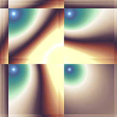</a>
       <b>Earth2</b>
    </td>
    <td width="33%" align="center">
      
       <b>Foo</b>
    </td>
    <td width="33%"></td>
  </tr>
</table>

## Sixsix

<table width="100%">
  <tr>
    <td width="33%" align="center">
      <a href="arts/sixsix/moon-over-window.png">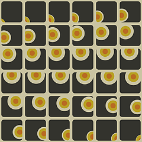</a>
       <b>Moon Over Window</b>
    </td>
    <td width="33%" align="center">
      <a href="arts/sixsix/six_0.png">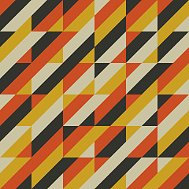</a>
       <b>Six 0</b>
    </td>
    <td width="33%" align="center">
      
       <b>Sixsix 1</b>
    </td>
  </tr>
  <tr>
    <td width="33%" align="center">
      
       <b>Sixsix 2</b>
    </td>
    <td width="33%"></td>
    <td width="33%"></td>
  </tr>
</table>

## Skyscraper

<table width="100%">
  <tr>
    <td width="33%" align="center">
      
       <b>Dualcity</b>
    </td>
    <td width="33%" align="center">
      
       <b>Perspective01</b>
    </td>
    <td width="33%" align="center">
      
       <b>Perspective02</b>
    </td>
  </tr>
  <tr>
    <td width="33%" align="center">
      <a href="arts/skyscraper/scrapers.png">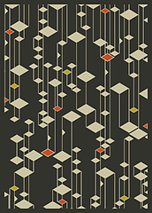</a>
       <b>Scrapers</b>
    </td>
    <td width="33%" align="center">
      
       <b>Skyscraper2</b>
    </td>
    <td width="33%" align="center">
      
       <b>Skyscraper</b>
    </td>
  </tr>
</table>

## Spiral

<table width="100%">
  <tr>
    <td width="33%" align="center">
      <a href="arts/spiral/spiral2.png">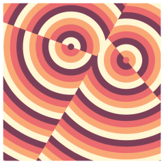</a>
       <b>Spiral2</b>
    </td>
    <td width="33%" align="center">
      
       <b>Spiral3</b>
    </td>
    <td width="33%" align="center">
      <a href="arts/spiral/spiral.png">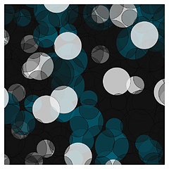</a>
       <b>Spiral</b>
    </td>
  </tr>
</table>

## Spirograph

<table width="100%">
  <tr>
    <td width="33%" align="center">
      <a href="arts/spirograph/spirograph1.png">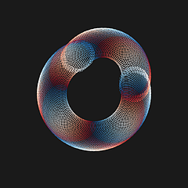</a>
       <b>Spirograph1</b>
    </td>
    <td width="33%" align="center">
      <a href="arts/spirograph/spirograph2.png">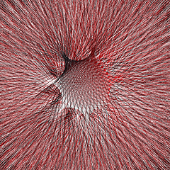</a>
       <b>Spirograph2</b>
    </td>
    <td width="33%"></td>
  </tr>
</table>

## Stripes

<table width="100%">
  <tr>
    <td width="33%" align="center">
      <a href="arts/stripes/s2.png">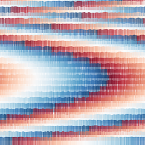</a>
       <b>S2</b>
    </td>
    <td width="33%" align="center">
      
       <b>Stripes1</b>
    </td>
    <td width="33%" align="center">
      <a href="arts/stripes/stripes.png">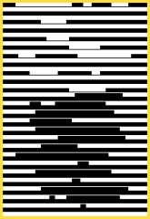</a>
       <b>Stripes</b>
    </td>
  </tr>
  <tr>
    <td width="33%" align="center">
      <a href="arts/stripes/tolerance.png">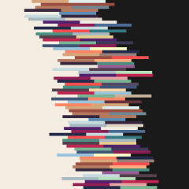</a>
       <b>Tolerance</b>
    </td>
    <td width="33%"></td>
    <td width="33%"></td>
  </tr>
</table>

## Sun

<table width="100%">
  <tr>
    <td width="33%" align="center">
      <a href="arts/sun/echoes1.png">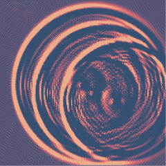</a>
       <b>Echoes1</b>
    </td>
    <td width="33%" align="center">
      
       <b>Echoes2</b>
    </td>
    <td width="33%" align="center">
      <a href="arts/sun/sunNS1.png">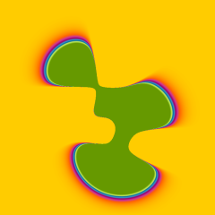</a>
       <b>SunNS1</b>
    </td>
  </tr>
  <tr>
    <td width="33%" align="center">
      <a href="arts/sun/sunlines.png">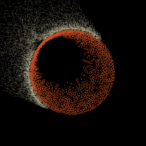</a>
       <b>Sunlines</b>
    </td>
    <td width="33%"></td>
    <td width="33%"></td>
  </tr>
</table>

## Switchboard

<table width="100%">
  <tr>
    <td width="33%" align="center">
      <a href="arts/switchboard/switchboard.png">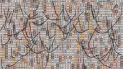</a>
       <b>Switchboard</b>
    </td>
    <td width="33%"></td>
    <td width="33%"></td>
  </tr>
</table>

## Td

<table width="100%">
  <tr>
    <td width="33%" align="center">
      <a href="arts/td/backbone.png">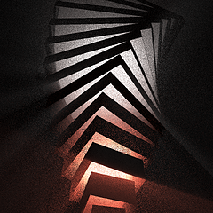</a>
       <b>Backbone</b>
    </td>
    <td width="33%" align="center">
      
       <b>Mesh</b>
    </td>
    <td width="33%" align="center">
      
       <b>Pandora</b>
    </td>
  </tr>
</table>

## Thre3

<table width="100%">
  <tr>
    <td width="33%" align="center">
      <a href="arts/thre3/noisepads.png">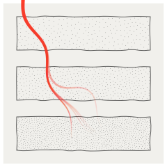</a>
       <b>Noisepads</b>
    </td>
    <td width="33%" align="center">
      
       <b>Surfing</b>
    </td>
    <td width="33%"></td>
  </tr>
</table>

## Ticktiletock

<table width="100%">
  <tr>
    <td width="33%" align="center">
      <a href="arts/ticktiletock/ticktiletock-1.png">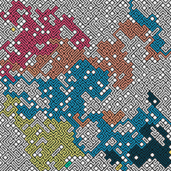</a>
       <b>Ticktiletock 1</b>
    </td>
    <td width="33%" align="center">
      <a href="arts/ticktiletock/ticktiletock.png">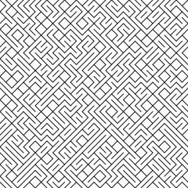</a>
       <b>Ticktiletock</b>
    </td>
    <td width="33%"></td>
  </tr>
</table>

## Triangular

<table width="100%">
  <tr>
    <td width="33%" align="center">
      <a href="arts/triangular/SaharaDiamond.png">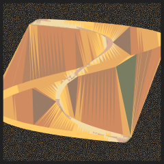</a>
       <b>SaharaDiamond</b>
    </td>
    <td width="33%" align="center">
      <a href="arts/triangular/Triage.png">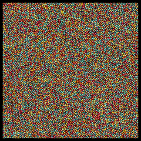</a>
       <b>Triage</b>
    </td>
    <td width="33%" align="center">
      
       <b>Ommatidia</b>
    </td>
  </tr>
</table>

## Z

<table width="100%">
  <tr>
    <td width="33%" align="center">
      <a href="arts/z/z10.png">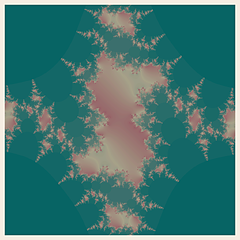</a>
       <b>Z10</b>
    </td>
    <td width="33%" align="center">
      <a href="arts/z/z11.png">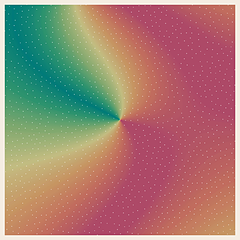</a>
       <b>Z11</b>
    </td>
    <td width="33%" align="center">
      <a href="arts/z/z1.png">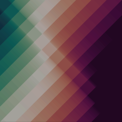</a>
       <b>Z1</b>
    </td>
  </tr>
  <tr>
    <td width="33%" align="center">
      
       <b>Z2</b>
    </td>
    <td width="33%" align="center">
      <a href="arts/z/z3.png">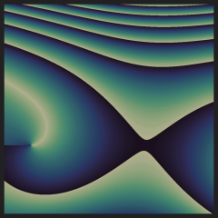</a>
       <b>Z3</b>
    </td>
    <td width="33%" align="center">
      <a href="arts/z/z4.png">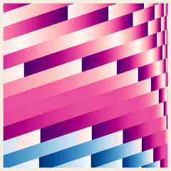</a>
       <b>Z4</b>
    </td>
  </tr>
  <tr>
    <td width="33%" align="center">
      <a href="arts/z/z5.png">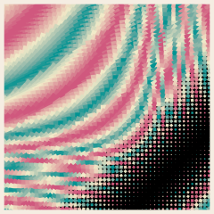</a>
       <b>Z5</b>
    </td>
    <td width="33%"></td>
    <td width="33%"></td>
  </tr>
</table>

---

🖼️ **249 works** across **50 collections** — and counting.
