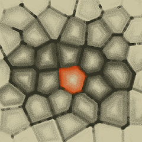
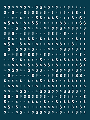
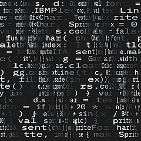
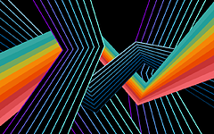
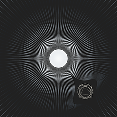
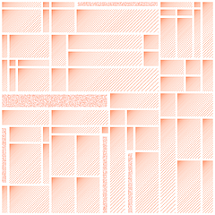
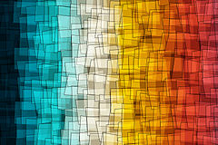

# gȧrt

🧧 gënérative ȧrt made by pragmatic [kotlin](WhyKotlin.md) micro-framework.

> ❤️ Follow: [Instagram](https://www.instagram.com/gart_173)

⭐️ **Gȧrt** is a pragmatical framework and set of utilities for generating and rendering
**still images** and **movies**.

+ uses [Skiko](https://github.com/JetBrains/skiko) (by JetBrains) for [Skia](https://skia.org) binding.
+ `box-2d` for physics simulation.
+ `ffmpeg` for video encoding.

TBH, the framework is made for my own needs; so it has some rough edges and not-great namings.
🤷‍♂️

Continuous build for **Hot Reload**:

```shell
just hotReload
```

## 🍭 Gȧlléry


A collection of generative art pieces (ordered by name).

## Alien

| [](arts/alien/alien-letters-v1_thumb.png) | [](arts/alien/alien-letters-v2_thumb.png) | [](arts/alien/alien-letters-v3_thumb.png) |

## Blob

| [](arts/blob/blob_thumb.jpg) |  |  |

## Bubbles

| [](arts/bubbles/BubbleStripe_thumb.png) | [](arts/bubbles/Bubbles2_thumb.png) |  |

## Cell

| [](arts/cell/cell1_thumb.png) |  |  |

## Circledots

| [](arts/circledots/circledots_thumb.png) |  |  |

## Cotton

| [](arts/cotton/cotton-circles2_thumb.png) | [](arts/cotton/cotton-circles_thumb.png) | [](arts/cotton/cotton1_thumb.png) |
| [](arts/cotton/cotton2_thumb.png) | [](arts/cotton/cotton3_thumb.png) |  |

## Example

| [](arts/example/example_thumb.png) |  |  |

## Falllines

| [](arts/falllines/falllines_thumb.png) |  |  |

## Flamebrush

| [](arts/flamebrush/flamebrush1_thumb.png) |  |  |

## Flowforce

| [](arts/flowforce/Eclectic2_thumb.png) | [](arts/flowforce/Eclectic_thumb.png) | [](arts/flowforce/Eclipse_thumb.png) |
| [](arts/flowforce/Spring_thumb.png) | [](arts/flowforce/circlex_thumb.png) | [](arts/flowforce/emergence_thumb.png) |
| [](arts/flowforce/flowforce1_thumb.png) | [](arts/flowforce/flowforce2_thumb.png) | [](arts/flowforce/flowforce3_thumb.png) |
| [](arts/flowforce/flowforce4_thumb.png) | [](arts/flowforce/interruption_thumb.png) | [](arts/flowforce/vorflow_thumb.png) |

## Harmongraph

| [](arts/harmongraph/hA_thumb.png) | [](arts/harmongraph/hB_thumb.png) | [](arts/harmongraph/hC_thumb.png) |
| [](arts/harmongraph/hD_thumb.png) | [](arts/harmongraph/hE_thumb.png) | [](arts/harmongraph/hF_thumb.png) |
| [](arts/harmongraph/hG_thumb.png) | [](arts/harmongraph/hH_thumb.png) | [](arts/harmongraph/harmongraph0_thumb.png) |
| [](arts/harmongraph/harmongraph1_thumb.png) | [](arts/harmongraph/harmongraph2_thumb.png) |  |

## Hills

| [](arts/hills/february_thumb.png) | [](arts/hills/hills_thumb.png) | [](arts/hills/horizons_thumb.png) |

## Igor

| [](arts/igor/igor_thumb.png) |  |  |

## Joydiv

| [](arts/joydiv/joydiv_thumb.png) |  |  |

## Kaleiircle

| [](arts/kaleiircle/kaleidoscope2-1_thumb.png) | [](arts/kaleiircle/kaleidoscope2-2_thumb.png) | [](arts/kaleiircle/kaleidoscope2_thumb.png) |
| [](arts/kaleiircle/kaleidoscope3_thumb.png) | [](arts/kaleiircle/kaleidoscope_thumb.png) | [](arts/kaleiircle/kaleiircle_thumb.png) |

## Legoo

| [](arts/legoo/Legoo12_thumb.png) | [](arts/legoo/Legoo1_thumb.png) | [](arts/legoo/Legoo2_thumb.png) |

## Lettero

| [](arts/lettero/LetterO_thumb.png) | [](arts/lettero/lettero2_thumb.png) | [](arts/lettero/lettero3-1_thumb.png) |
| [](arts/lettero/lettero3-2_thumb.png) | [](arts/lettero/lettero3_thumb.png) |  |

## Lines

| [](arts/lines/citymap_thumb.png) | [](arts/lines/swing2_thumb.png) | [](arts/lines/swing3_thumb.png) |
| [](arts/lines/swing_thumb.png) | [](arts/lines/triangles_thumb.png) |  |

## Lissajous

| [](arts/lissajous/lissajous_thumb.png) | [](arts/lissajous/moire_thumb.png) |  |

## Metro

| [](arts/metro/metro2_thumb.png) | [](arts/metro/metro_thumb.png) |  |

## Monet

| [](arts/monet/monet1-0_thumb.png) | [](arts/monet/monet1_thumb.png) | [](arts/monet/monet2_thumb.png) |

## Palecircles

| [](arts/palecircles/palecircles_thumb.png) |  |  |

## Plasma

| [](arts/plasma/plasma2_thumb.png) | [](arts/plasma/plasma3_thumb.png) | [](arts/plasma/plasma4_thumb.png) |
| [](arts/plasma/plasma_thumb.png) |  |  |

## Rayz

| [](arts/rayz/rayz2-1_thumb.png) | [](arts/rayz/rayz2-2_thumb.png) | [](arts/rayz/rayz2-3_thumb.png) |
| [](arts/rayz/rayz_thumb.png) |  |  |

## Rectapart

| [](arts/rectapart/rectApart_thumb.png) |  |  |

## Rects

| [](arts/rects/cells_thumb.png) | [](arts/rects/divine-divide_thumb.png) | [](arts/rects/mondrian-01_thumb.png) |
| [](arts/rects/mondrian-02_thumb.png) | [](arts/rects/mondrian-03_thumb.png) | [](arts/rects/rects-over_thumb.png) |
| [](arts/rects/rects1_thumb.png) | [](arts/rects/rects2_thumb.png) |  |

## Repetition

| [](arts/repetition/Repetition1_thumb.png) | [](arts/repetition/Repetition2_thumb.png) |  |

## Rotoro

| [](arts/rotoro/rotoro1_thumb.png) | [](arts/rotoro/rotoro2-0_thumb.png) | [](arts/rotoro/rotoro2-1_thumb.png) |
| [](arts/rotoro/rotoro2-2_thumb.png) | [](arts/rotoro/rotoro2_thumb.png) | [](arts/rotoro/rotoro3_thumb.png) |

## Roundrects

| [](arts/roundrects/roundrects_thumb.png) |  |  |

## Sea

| [](arts/sea/sea_thumb.png) |  |  |

## Sf

| [](arts/sf/sf10_thumb.png) | [](arts/sf/sf1_thumb.png) | [](arts/sf/sf2_thumb.png) |
| [](arts/sf/sf3_thumb.png) | [](arts/sf/sf4_thumb.png) | [](arts/sf/sf5_thumb.png) |
| [](arts/sf/sf6_thumb.png) | [](arts/sf/sf7_thumb.png) | [](arts/sf/sf8_thumb.png) |
| [](arts/sf/sf9_thumb.png) |  |  |

## Skyscraper

| [](arts/skyscraper/skyscraper2_thumb.png) | [](arts/skyscraper/skyscraper_thumb.png) |  |

## Spiral

| [](arts/spiral/spiral2_thumb.png) | [](arts/spiral/spiral3_thumb.png) | [](arts/spiral/spiral_thumb.png) |

## Spirograph

| [](arts/spirograph/spirograph1_thumb.png) | [](arts/spirograph/spirograph2_thumb.png) |  |

## Stripes

| [](arts/stripes/stripes1_thumb.png) | [](arts/stripes/stripes_thumb.png) | [](arts/stripes/tolerance_thumb.png) |

## Sun

| [](arts/sun/echoes1_thumb.png) | [](arts/sun/echoes2_thumb.png) | [](arts/sun/sunNS1_thumb.png) |
| [](arts/sun/sunlines_thumb.png) |  |  |

## Switchboard

| [](arts/switchboard/switchboard_thumb.png) |  |  |

## Thre3

| [](arts/thre3/noisepads_thumb.png) | [](arts/thre3/surfing_thumb.png) |  |

## Ticktiletock

| [](arts/ticktiletock/ticktiletock_thumb.png) |  |  |

## Triangular

| [](arts/triangular/SaharaDiamond_thumb.png) | [](arts/triangular/Triage_thumb.png) |  |

## Z

| [](arts/z/z1_thumb.png) | [](arts/z/z2_thumb.png) | [](arts/z/z3_thumb.png) |
| [](arts/z/z4_thumb.png) | [](arts/z/z5_thumb.png) |  |

---

**Total: 133 thumbnails across 41 art collections**
