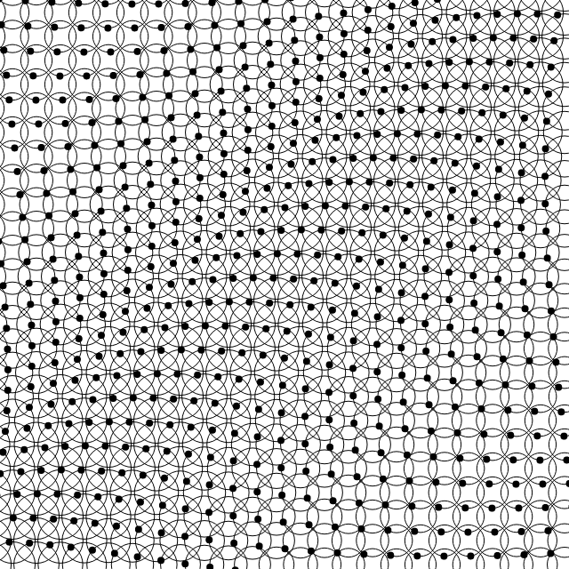
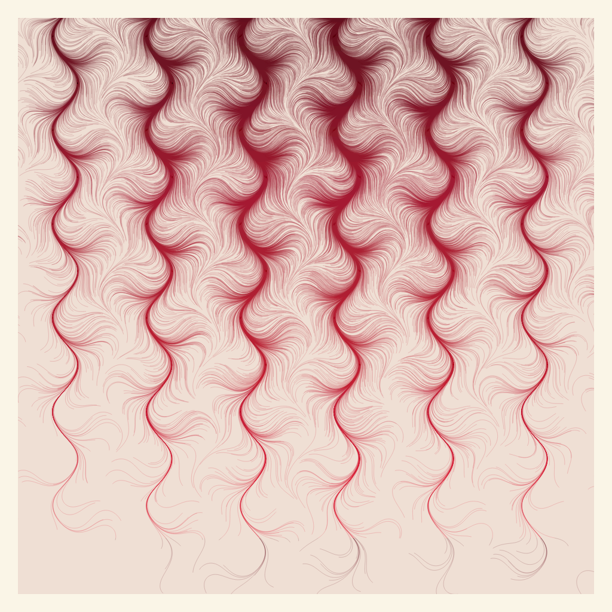
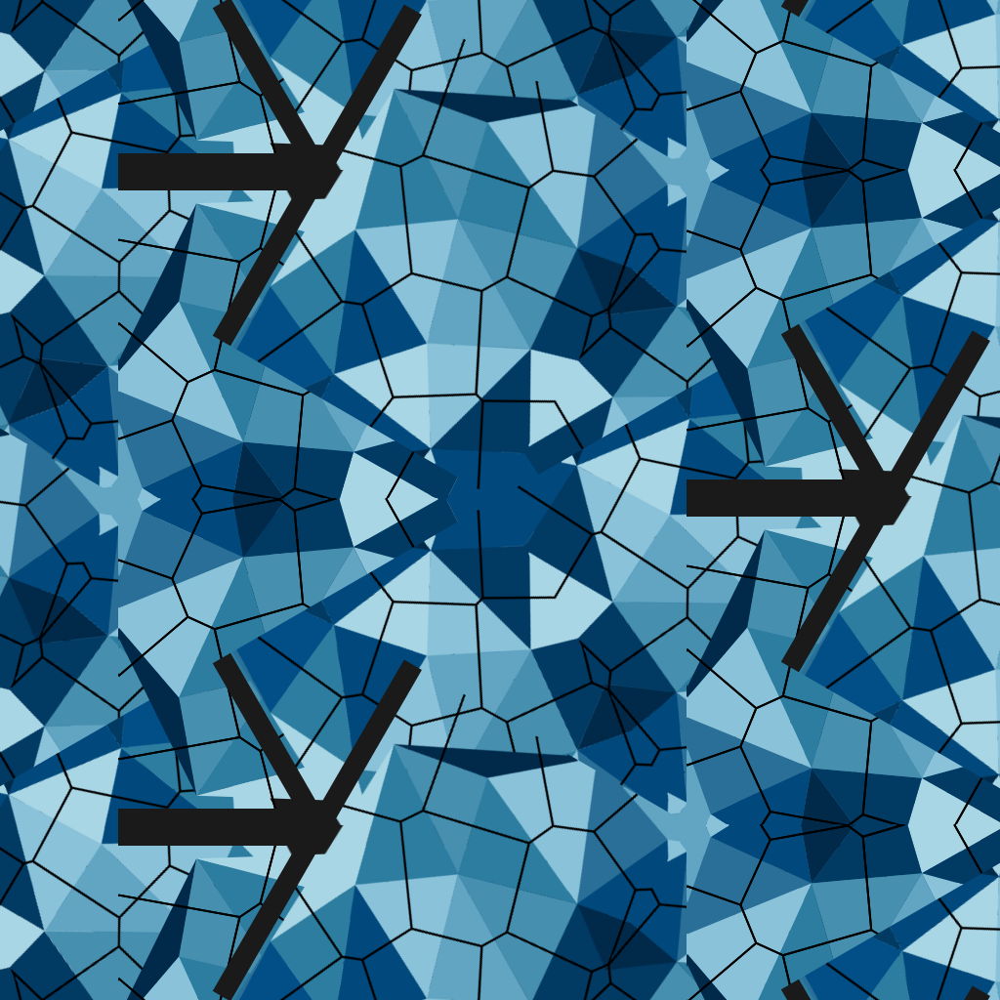
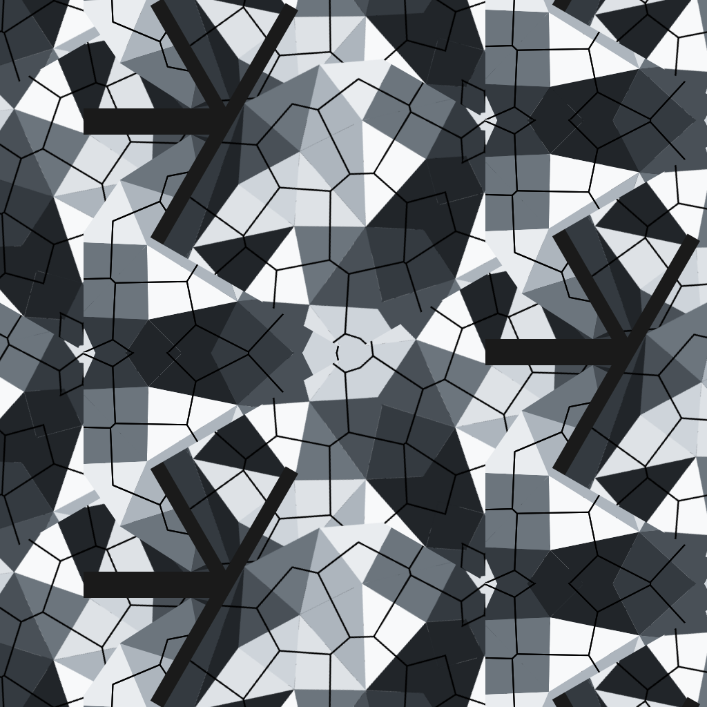
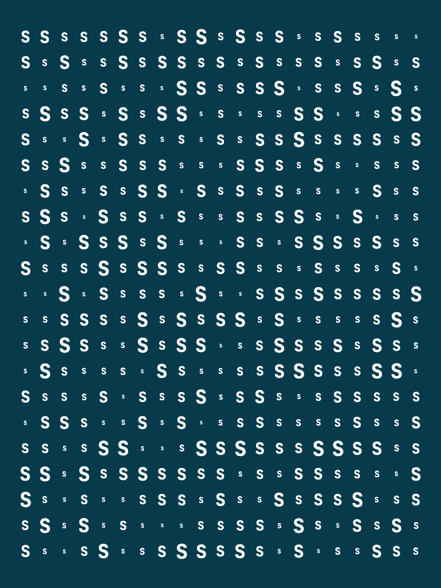
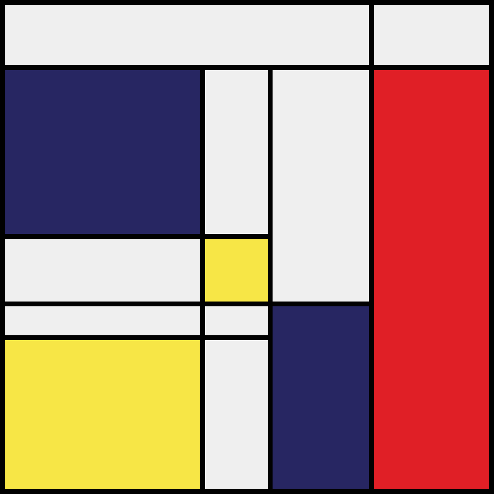
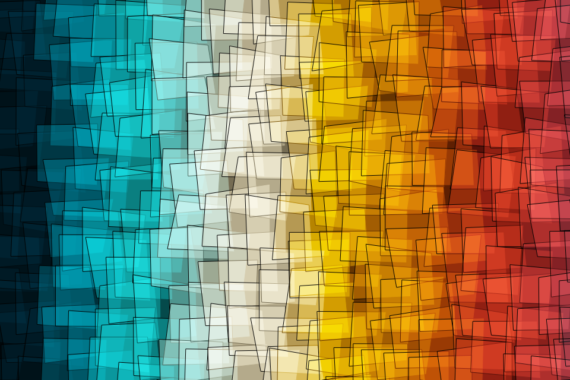
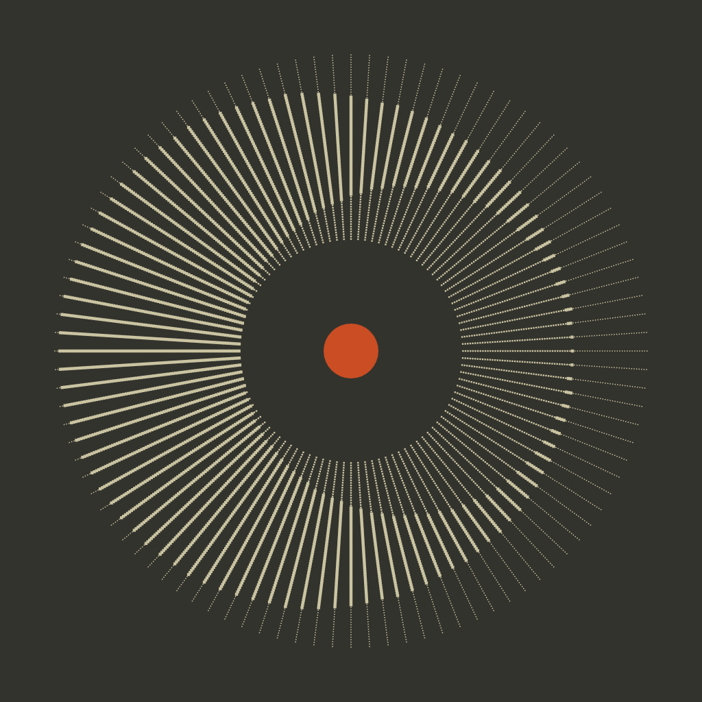
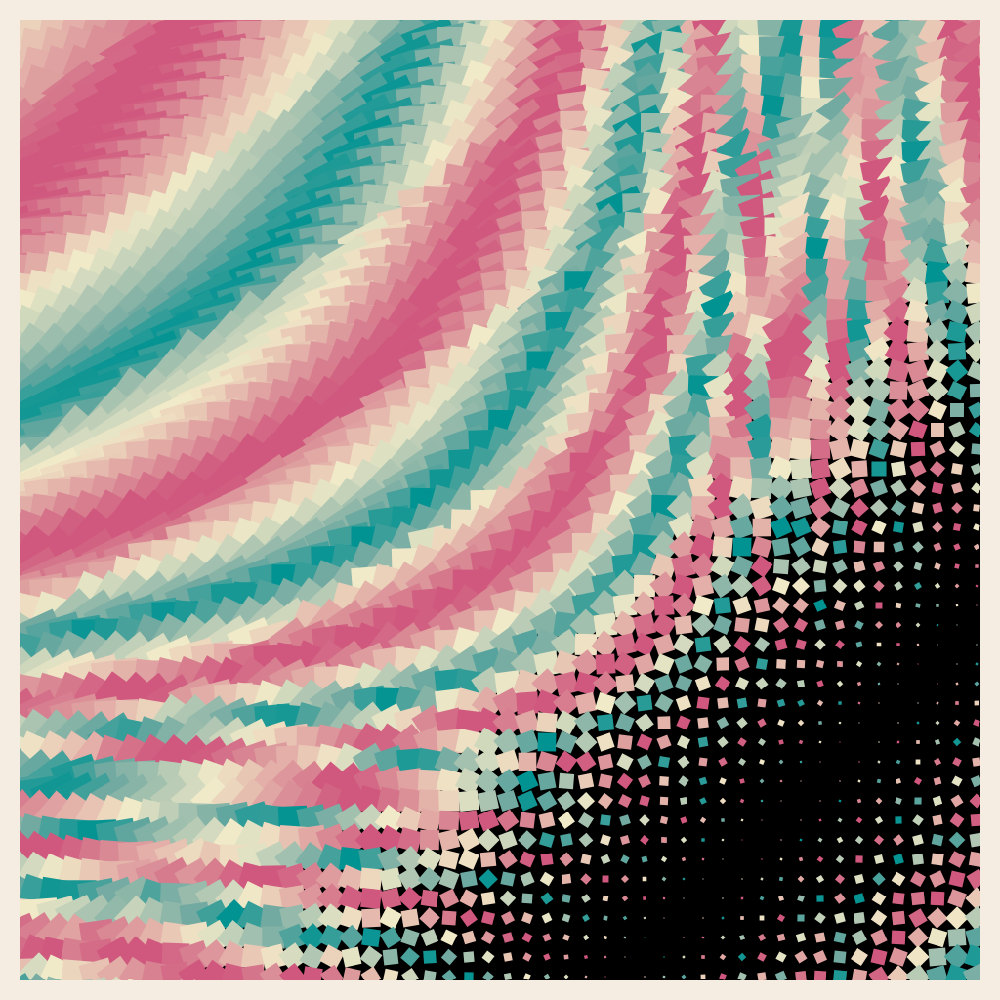

# gȧrt

🧧 gënérative ȧrt made by pragmatic [kotlin](WhyKotlin.md) micro-framework.

> ❤️ Follow: [Instagram](https://www.instagram.com/gart_173)

⭐️ **Gȧrt** is a pragmatical framework and set of utilities for generating and rendering
**still images** and **movies**.

+ uses [Skiko](https://github.com/JetBrains/skiko) (by JetBrains) for [Skia](https://skia.org) binding.
+ `box-2d` for physics simulation.
+ `ffmpeg` for video encoding.

TBH, the framework is made for my own needs; so it has some rough edges and not-great namings.
🤷‍♂️

Continuous build for **Hot Reload**:

```shell
just hotReload
```

## 🍭 Gȧlléry


A collection of generative art pieces (ordered by name).

## Alien

<p align="left">
    
    
    
</p>
<br clear="both">

## Blob

<p align="left">
    
</p>
<br clear="both">

## Bubbles

<p align="left">
    
    
</p>
<br clear="both">

## Cell

<p align="left">
    
</p>
<br clear="both">

## Circledots

<p align="left">
    
</p>
<br clear="both">

## Cotton

<p align="left">
    
    
    
    
    
</p>
<br clear="both">

## Falllines

<p align="left">
    
</p>
<br clear="both">

## Flamebrush

<p align="left">
    
</p>
<br clear="both">

## Flowforce

<p align="left">
    
    
    
    
    
    
    
    
    
    
    
    
</p>
<br clear="both">

## Harmongraph

<p align="left">
    
    
    
    
    
    
    
    
    
    
    
</p>
<br clear="both">

## Hills

<p align="left">
    
    
    
</p>
<br clear="both">

## Igor

<p align="left">
    
</p>
<br clear="both">

## Joydiv

<p align="left">
    
</p>
<br clear="both">

## Kaleiircle

<p align="left">
    
    
    
    
    
    
</p>
<br clear="both">

## Legoo

<p align="left">
    
    
    
</p>
<br clear="both">

## Lettero

<p align="left">
    
    
    
    
    
</p>
<br clear="both">

## Lines

<p align="left">
    
    
    
    
    
    
    
    
</p>
<br clear="both">

## Lissajous

<p align="left">
    
    
</p>
<br clear="both">

## Metro

<p align="left">
    
    
</p>
<br clear="both">

## Monet

<p align="left">
    
    
    
</p>
<br clear="both">

## Palecircles

<p align="left">
    
</p>
<br clear="both">

## Pixelmania

<p align="left">
    
    
    
    
</p>
<br clear="both">

## Plasma

<p align="left">
    
    
    
    
</p>
<br clear="both">

## Rayz

<p align="left">
    
    
    
    
    
    
</p>
<br clear="both">

## Rectapart

<p align="left">
    
</p>
<br clear="both">

## Rects

<p align="left">
    
    
    
    
    
    
    
    
    
    
    
</p>
<br clear="both">

## Repetition

<p align="left">
    
    
</p>
<br clear="both">

## Rotoro

<p align="left">
    
    
    
    
    
    
</p>
<br clear="both">

## Roundrects

<p align="left">
    
</p>
<br clear="both">

## Sea

<p align="left">
    
</p>
<br clear="both">

## Sf

<p align="left">
    
    
    
    
    
    
    
    
    
    
</p>
<br clear="both">

## Skyscraper

<p align="left">
    
    
</p>
<br clear="both">

## Spiral

<p align="left">
    
    
    
</p>
<br clear="both">

## Spirograph

<p align="left">
    
    
</p>
<br clear="both">

## Stripes

<p align="left">
    
    
    
    
</p>
<br clear="both">

## Sun

<p align="left">
    
    
    
    
</p>
<br clear="both">

## Switchboard

<p align="left">
    
</p>
<br clear="both">

## Thre3

<p align="left">
    
    
</p>
<br clear="both">

## Ticktiletock

<p align="left">
    
</p>
<br clear="both">

## Triangular

<p align="left">
    
    
</p>
<br clear="both">

## Z

<p align="left">
    
    
    
    
    
</p>
<br clear="both">

---

**Total: 145 works across 41 collections**
