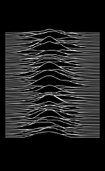
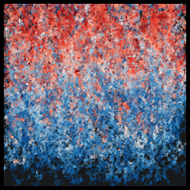
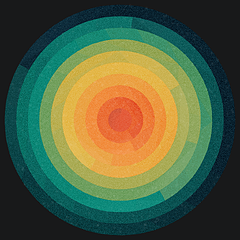
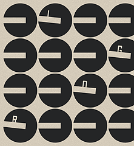
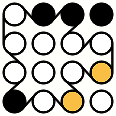

# gȧrt

🧧 gënérative ȧrt made by pragmatic kotlin micro-framework.

**Gȧrt** is a pragmatical framework and set of utilities for generating and rendering **still images** and **movies**.

+ uses [Skiko](https://github.com/JetBrains/skiko) (by JetBrains) for [Skia](https://skia.org) binding.
+ minor RNDR use for formulas only.
+ ffmpeg for video encoding.

### [Examples](arts/example/README.md)

⚠️️ As the library grows, it changes. Some examples may need to be updated. I don't have time to maintain everything.
🤷‍♂️

Follow: [Instagram](https://www.instagram.com/gart_173)

## 🍭 Gȧlléry

⭐️ [Plasma](arts/plasma/README.md)

⭐️ [Circle Dots](arts/circledots/README.md)

⭐️ [Joy Division](arts/joydiv/README.md)

⭐️ [Skyscraper](arts/skyscraper/README.md)

⭐️ [Fall lines](arts/falllines/README.md)

⭐️ [Kaleidoscopics](arts/kaleiircle/README.md)

⭐️ [Tick Tile Tock](arts/ticktiletock/README.md)

⭐️ [Bubbles](arts/bubbles/README.md)

 

⭐️ [Lettero](arts/lettero/README.md)

 

⭐️ [Round Rects](arts/roundrects/README.md)

⭐️ [Pale Circles](arts/palecircles/README.md)

⭐️ [Spiral](arts/spiral/README.md)

⭐️ [Lissajous](arts/lissajous/README.md)

 

⭐️ [Harmongraph](arts/harmongraph/README.md)

 

⭐️ [flowforce](arts/flowforce/README.md)

 

⭐️ [Repetition](arts/repetition/README.md)

 

⭐️ [Rects](arts/rects/README.md)

 

⭐️ [Metro](arts/metro/README.md)

 

⭐️ [Cotton](arts/cotton/README.md)

 

⭐️ [Thre3](arts/thre3/README.md)

 

⭐️ [Igor](arts/igor/README.md)

 

⭐️ [flamebrush](arts/flamebrush/README.md)

 

⭐️ [Legoo](arts/legoo/README.md)

 

⭐️ [RectAPart](arts/rectapart/README.md)

 

⭐️ [SwitchBoard](arts/switchboard/README.md)

 

⭐️ [Triangular](arts/triangular/README.md)

 

⭐️ [Stripes](arts/stripes/README.md)

 

⭐️ [Sea](arts/sea/README.md)

 

⭐️ [blob](arts/blob/README.md)

 

⭐️ [sun](arts/sun/README.md)

 

⭐️ [Alien Letters](arts/alien/README.md)

 

⭐️ [hills](arts/hills/README.md)

 

⭐️ [rayz](arts/rayz/README.md)

 

⭐️ [rotoro](arts/rotoro/README.md)

