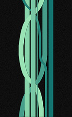
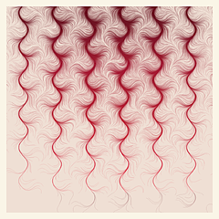

# gȧrt

🧧 gënérative ȧrt made by pragmatic kotlin micro-framework.

**Gȧrt** is pragmatical framework and set of utilities for generating and rendering **still images** and **movies**.

+ uses [Skiko](https://github.com/JetBrains/skiko) (by JetBrains) for [Skia](https://skia.org) binding.
+ minor RNDR use for formulas only.
+ ffmpeg for video encoding.

### [Example](arts/example/README.md)

⚠️️ As the library grows, it changes. Some examples may need to be updated. I don't have time to maintain everything.
🤷‍♂️

Follow: [Instagram](https://www.instagram.com/gart_173)

## 🍭 Gȧlléry

⭐️ [Zen. Plasma. Watter.](arts/plasma/README.md)

⭐️ [Dots. Wave. Flash.](arts/circledots/README.md)

⭐️ [Love. Tear. Apart.](arts/joydiv/README.md)

⭐️ [City. High. Sky.](arts/skyscraper/README.md)

⭐️ [Line. Line. Falls.](arts/falllines/README.md)

⭐️ [Twist.Color. Turn.](arts/kaleiircle/README.md)

⭐️ [Tick. Tile. Tock.](arts/ticktiletock/README.md)

⭐️ [Bub. Ll. Es.](arts/bubbles/README.md)

⭐️ [Letter. Pattern. Repeat.](arts/lettero/README.md)

⭐️ [Round. Rect. Rotate.](arts/roundrects/README.md)

⭐️ [Pale. Uneasy. Tremble.](arts/palecircles/README.md)

⭐️ [Chaos. Order. Lights.](arts/spiral/README.md)

⭐️ [Organic. Mesh. Web.](arts/lissajous/README.md)

⭐️ [Har. Mon. Ich.](arts/harmongraph/README.md)

 

⭐️ [Solitude. Solace. Serenity.](arts/flowforce/README.md)

 

⭐️ [Repe. Repeti. Repetition.](arts/repetition/README.md)

 

⭐️ [Rect. Rect. Rect](arts/rects/README.md)

 

⭐️ [Metro](arts/metro/README.md)

 

⭐️ [Cotton](arts/cotton/README.md)

 

⭐️ [Thre3](arts/thre3/README.md)

 

⭐️ [Igor](arts/igor/README.md)

 

⭐️ [flamebrush](arts/flamebrush/README.md)

 

⭐️ [Legoo](arts/legoo/README.md)

 

⭐️ [RectAPart](arts/rectapart/README.md)

 

⭐️ [SwitchBoard](arts/switchboard/README.md)

 

⭐️ [Triangular](arts/triangular/README.md)

 

⭐️ [Stripes](arts/stripes/README.md)

 

⭐️ [sea](arts/sea/README.md)

 

⭐️ [blob](arts/blob/README.md)

 

⭐️ [sun](arts/sun/README.md)

