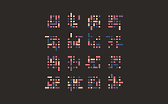
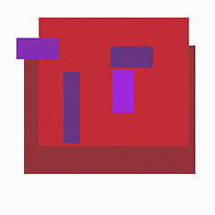
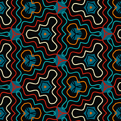
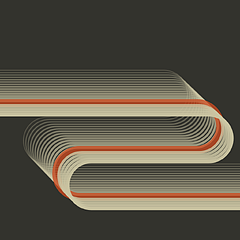
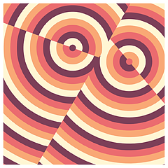

# gȧrt

🧧 gënérative ȧrt made by pragmatic [kotlin](WhyKotlin.md) micro-framework.

> ❤️ [Instagram](https://www.instagram.com/gart_173) / [Online Gallery](https://igo.rs/gart)

⭐️ **Gȧrt** is a pragmatical framework and set of utilities for generating and rendering
**still images** and **movies**.

+ uses [Skiko](https://github.com/JetBrains/skiko) (by JetBrains) for [Skia](https://skia.org) binding.
+ `box-2d` for physics simulation.
+ `ffmpeg` for video encoding.

🤷‍♂️ Honestly, I put the framework together for my own needs, so it’s a bit rough around the edges and the naming isn’t
great. _It’s not how I normally write code._

♻️ Continuous build for **Hot Reload**:

```shell
just hotReload
```

## 🚀 Features

There is really **a lot of features**, and I’m not sure how to organize them, but here’s an attempt at categorization:

Core Framework

- Gart — Factory/entry point (Gart.of("name", w, h))
- Gartvas — Canvas wrapper (Skia Surface)
- Window / WindowView — Swing display with keyboard/mouse handlers
- Movie — MP4/GIF video recording (FFmpeg + GifSequenceWriter)
- Frames — Frame timing, FPS control
- GartRand — Deterministic random with replay
- Sprite — Image with chainable transforms (rotate, translate, scale, flip)

Color

- Color spaces: RGBA, HSL, HSV, HSI, LAB, LCH, OKLAB, OKLCH, CMYK
- Palettes: 76 cool + 15 mix + 133 colormaps (Carto, CET, ColorBrewer, Matplotlib, Plotly, Tableau, etc.)
- Named colors: CssColors, NipponColors, RetroColors, MidCenturyColors
- Functions: blendColors, lerpColor, colorDistance, toFillPaint, toStrokePaint

Geometry & Graphics

- Primitives: Point, Line, DLine, Circle, Triangle, Poly4, Rect, GridRect, RectIsometric
- Collections: Points, PointsTrail
- Drawing: drawCircle, drawLine, drawPoly4, drawTriangle, drawRotatedRect, fatLine, n-gon, arc, ring, spiral, wave,
  grid, border, moon, tree, human
- Paint helpers: strokeOf, fillOf, hatchPaint, dashPaint

Math & Vectors

- Vectors: Vector2/3/4, Matrix2, dot/cross product
- Complex numbers: Complex, ComplexField, ComplexPolynomial, transcendental functions
- Curves: Lissajous, GaussianFunction
- Utilities: clamp, map, lerp, smoothstep, frac, mod, distance, primes, fastSqrt
- Angles: Radians, Degrees with trig functions

Noise & Sampling

- Noise: Perlin, multi-octave PerlinNoise, cell noise, FBM
- Sampling: Halton sequence, Poisson disk sampling
- NoiseColor — Noise-driven color generation

Curve Smoothing

- B-spline, Cardinal spline, Catmull-Rom spline, Chaikin, quadratic smoothing

Physics & Simulation

- Attractors (19): Lorenz, Clifford, Rössler, Duffing, Thomas, Chen, Sprott, etc.
- N-body: BarnesHut simulation, QuadTree, GravityParticles (10^6+)
- Orbital mechanics (WHFast): Wisdom-Holman integrator, Kepler solver, orbital elements
- Fluid dynamics: Navier-Stokes solver, Lattice Boltzmann, FluidSolver with particle rendering
- Cellular automata: Elementary rules, Belousov-Zhabotinsky reaction
- Force fields: ForceField, Flow, ForceGenerator
- Particles: Particle system, Gravitron

Spatial & Triangulation

- Delaunay triangulation (Mapbox Delaunator port)
- Voronoi diagrams
- HashGrid — Spatial hash for fast neighbor queries
- Circle packing — CirclePacker
- Jump Flooding Algorithm — Distance fields

Pixel Processing

- Filters: Gaussian blur, motion blur, grayscale, liquify, moiré, pixel sorting, flood fill, scaling
- Dithering (12): Floyd-Steinberg, Bayer (2x2–8x8), Atkinson, Burkes, Jarvis-Judice-Ninke, Sierra, Stucki
- Halftone: CMYK separation, configurable screening

Shaders & Effects

- Shaders: neuro, marbled texture, noise grain, risograph, sketching paper
- FX: blur, borderize, pixelate, scale
- Glass/refraction: glassBall, glassPath
- Ray tracing: ray, trace, mirror
- 3D perspective: block3d (two-point perspective)

Generators

- Spirograph, harmonograph, midpoint displacement (terrain)

Utilities

- Hot reload (file watcher + dynamic class loader)
- Font loading, text rendering
- Image conversion, resource loading
- Array/list/loop/range/sequence helpers

## 🧪 Example

Example folder contains several small projects demonstrating various features of the framework.

+ `Example*` - demonstrations of various features, usually interactive.
+ `Template` - minimal project template to start with.
+ `TemplateHotReload` - same as above, but with hot-reload enabled.
+ Tools:
  + `GradientGenerator` - interactive gradient palette generator.
  + `FunGraph` - interactive function plotter.

## 🍭 Gȧlléry


A collection of generative art pieces (ordered by name).

## Alien

[](arts/alien/alien-letters-v1.png)
[](arts/alien/alien-letters-v2.png)
[](arts/alien/alien-letters-v3.png)
[](arts/alien/alien2.png)
<br clear="both">

## Blob

[](arts/blob/blob.jpg)
<br clear="both">

## Bubbles

[](arts/bubbles/BubbleStripe.png)
[](arts/bubbles/Bubbles2.png)
[](arts/bubbles/bubble-stripe-2.png)
[](arts/bubbles/bubbub.png)
[](arts/bubbles/pebble1.png)
[](arts/bubbles/pebble2.png)
<br clear="both">

## Cell

[](arts/cell/cell1.png)
<br clear="both">

## Circledots

[](arts/circledots/awaking.png)
[](arts/circledots/circledots.png)
[](arts/circledots/fbf1.png)
[](arts/circledots/fbf2.png)
[](arts/circledots/gentle.png)
[](arts/circledots/guzv.png)
[](arts/circledots/xy-1.png)
[](arts/circledots/xy-2.png)
[](arts/circledots/xy-3.png)
<br clear="both">

## Cotton

[](arts/cotton/cotton-circles2.png)
[](arts/cotton/cotton-circles.png)
[](arts/cotton/cotton1.png)
[](arts/cotton/cotton2.png)
[](arts/cotton/cotton3.png)
<br clear="both">

## Falllines

[](arts/falllines/falllines.png)
<br clear="both">

## Flamebrush

[](arts/flamebrush/flamebrush1.png)
<br clear="both">

## Flowforce

[](arts/flowforce/Eclectic2.png)
[](arts/flowforce/Eclectic.png)
[](arts/flowforce/Eclipse.png)
[](arts/flowforce/Spring.png)
[](arts/flowforce/circlex.png)
[](arts/flowforce/emergence.png)
[](arts/flowforce/flowforce1.png)
[](arts/flowforce/flowforce2.png)
[](arts/flowforce/flowforce3.png)
[](arts/flowforce/flowforce4.png)
[](arts/flowforce/interruption.png)
[](arts/flowforce/vorflow.png)
<br clear="both">

## Fluid

[](arts/fluid/fluid-pack.png)
[](arts/fluid/fluid-wind.png)
<br clear="both">

## Harmongraph

[](arts/harmongraph/hA.png)
[](arts/harmongraph/hB.png)
[](arts/harmongraph/hC.png)
[](arts/harmongraph/hD.png)
[](arts/harmongraph/hE.png)
[](arts/harmongraph/hF.png)
[](arts/harmongraph/hG.png)
[](arts/harmongraph/hH.png)
[](arts/harmongraph/harmongraph0.png)
[](arts/harmongraph/harmongraph1.png)
[](arts/harmongraph/harmongraph2.png)
<br clear="both">

## Hills

[](arts/hills/february.png)
[](arts/hills/hills.png)
[](arts/hills/horizons.png)
<br clear="both">

## Igor

[](arts/igor/igor.png)
<br clear="both">

## Joydiv

[](arts/joydiv/joydiv.png)
<br clear="both">

## Kaleiircle

[](arts/kaleiircle/kaleidoscope2-1.png)
[](arts/kaleiircle/kaleidoscope2-2.png)
[](arts/kaleiircle/kaleidoscope2.png)
[](arts/kaleiircle/kaleidoscope3.png)
[](arts/kaleiircle/kaleidoscope.png)
[](arts/kaleiircle/kaleiircle.png)
<br clear="both">

## Legoo

[](arts/legoo/Legoo12.png)
[](arts/legoo/Legoo1.png)
[](arts/legoo/Legoo2.png)
<br clear="both">

## Lettero

[](arts/lettero/LetterO.png)
[](arts/lettero/lettero2.png)
[](arts/lettero/lettero3-1.png)
[](arts/lettero/lettero3-2.png)
[](arts/lettero/lettero3.png)
<br clear="both">

## Lines

[](arts/lines/citymap.png)
[](arts/lines/heapspace.png)
[](arts/lines/ngons.png)
[](arts/lines/outline.png)
[](arts/lines/stripes1.png)
[](arts/lines/stripes2.png)
[](arts/lines/swing2.png)
[](arts/lines/swing3.png)
[](arts/lines/swing.png)
[](arts/lines/tapesA.png)
[](arts/lines/tapesB.png)
[](arts/lines/triadance2.png)
[](arts/lines/triangles.png)
[](arts/lines/tridance.png)
<br clear="both">

## Lissajous

[](arts/lissajous/lissajous.png)
[](arts/lissajous/moire.png)
<br clear="both">

## Metro

[](arts/metro/metro2.png)
[](arts/metro/metro.png)
<br clear="both">

## Monet

[](arts/monet/monet1-0.png)
[](arts/monet/monet1.png)
[](arts/monet/monet2.png)
<br clear="both">

## Neuromancer

[](arts/neuromancer/nm1.png)
<br clear="both">

## Orbitr

[](arts/orbitr/orbitr.png)
<br clear="both">

## Palecircles

[](arts/palecircles/all-circles.png)
[](arts/palecircles/palecircles.png)
<br clear="both">

## Pixelmania

[](arts/pixelmania/circl.png)
[](arts/pixelmania/glass.png)
[](arts/pixelmania/liqf.png)
[](arts/pixelmania/rastersin.png)
[](arts/pixelmania/romb.png)
[](arts/pixelmania/stripo.png)
[](arts/pixelmania/tower01.png)
<br clear="both">

## Plasma

[](arts/plasma/plasma2.png)
[](arts/plasma/plasma3.png)
[](arts/plasma/plasma4.png)
[](arts/plasma/plasma.png)
<br clear="both">

## Rayz

[](arts/rayz/mirrorz2.png)
[](arts/rayz/mirrorz.png)
[](arts/rayz/rayz2-1.png)
[](arts/rayz/rayz2-2.png)
[](arts/rayz/rayz2-3.png)
[](arts/rayz/rayz.png)
<br clear="both">

## Rectapart

[](arts/rectapart/fall-squares.png)
[](arts/rectapart/rectApart.png)
[](arts/rectapart/rectapart3.png)
[](arts/rectapart/rectpack1.png)
[](arts/rectapart/rectpack2.png)
<br clear="both">

## Rects

[](arts/rects/cells.png)
[](arts/rects/divine-divide.png)
[](arts/rects/impossible-rubik-one.png)
[](arts/rects/impossible-rubik-three.png)
[](arts/rects/impossible-rubik-two.png)
[](arts/rects/mondrian-01.png)
[](arts/rects/mondrian-02.png)
[](arts/rects/mondrian-03.png)
[](arts/rects/rects-over.png)
[](arts/rects/rects1.png)
[](arts/rects/rects2.png)
<br clear="both">

## Repetition

[](arts/repetition/Repetition1.png)
[](arts/repetition/Repetition2.png)
<br clear="both">

## Rotoro

[](arts/rotoro/rotoro1.png)
[](arts/rotoro/rotoro2-0.png)
[](arts/rotoro/rotoro2-1.png)
[](arts/rotoro/rotoro2-2.png)
[](arts/rotoro/rotoro2.png)
[](arts/rotoro/rotoro3.png)
<br clear="both">

## Roundrects

[](arts/roundrects/roundrects.png)
<br clear="both">

## Rule

[](arts/rule/rulez01.png)
[](arts/rule/rulez02.png)
<br clear="both">

## Sea

[](arts/sea/sea.png)
<br clear="both">

## Sf

[](arts/sf/sf10.png)
[](arts/sf/sf1.png)
[](arts/sf/sf2.png)
[](arts/sf/sf3.png)
[](arts/sf/sf4.png)
[](arts/sf/sf5.png)
[](arts/sf/sf6.png)
[](arts/sf/sf7.png)
[](arts/sf/sf8.png)
[](arts/sf/sf9.png)
<br clear="both">

## Shad

[](arts/shad/earth2.png)
[](arts/shad/foo.png)
<br clear="both">

## Sixsix

[](arts/sixsix/moon-over-window.png)
[](arts/sixsix/six_0.png)
[](arts/sixsix/sixsix_1.png)
[](arts/sixsix/sixsix_2.png)
<br clear="both">

## Skyscraper

[](arts/skyscraper/dualcity.png)
[](arts/skyscraper/perspective01.png)
[](arts/skyscraper/perspective02.png)
[](arts/skyscraper/skyscraper2.png)
[](arts/skyscraper/skyscraper.png)
<br clear="both">

## Spiral

[](arts/spiral/spiral2.png)
[](arts/spiral/spiral3.png)
[](arts/spiral/spiral.png)
<br clear="both">

## Spirograph

[](arts/spirograph/spirograph1.png)
[](arts/spirograph/spirograph2.png)
<br clear="both">

## Stripes

[](arts/stripes/s2.png)
[](arts/stripes/stripes1.png)
[](arts/stripes/stripes.png)
[](arts/stripes/tolerance.png)
<br clear="both">

## Sun

[](arts/sun/echoes1.png)
[](arts/sun/echoes2.png)
[](arts/sun/sunNS1.png)
[](arts/sun/sunlines.png)
<br clear="both">

## Switchboard

[](arts/switchboard/switchboard.png)
<br clear="both">

## Thre3

[](arts/thre3/noisepads.png)
[](arts/thre3/surfing.png)
<br clear="both">

## Ticktiletock

[](arts/ticktiletock/ticktiletock.png)
<br clear="both">

## Triangular

[](arts/triangular/SaharaDiamond.png)
[](arts/triangular/Triage.png)
<br clear="both">

## Z

[](arts/z/z1.png)
[](arts/z/z2.png)
[](arts/z/z3.png)
[](arts/z/z4.png)
[](arts/z/z5.png)
<br clear="both">

---

**Total: 187 works across 47 collections**
