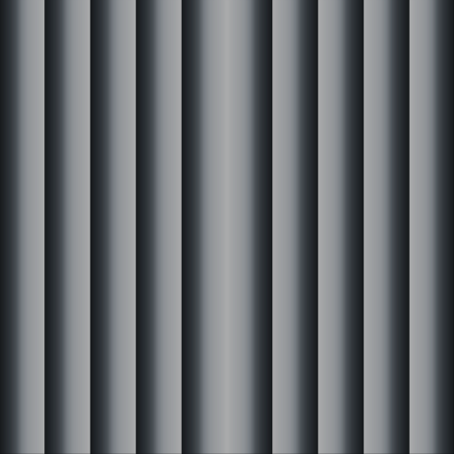
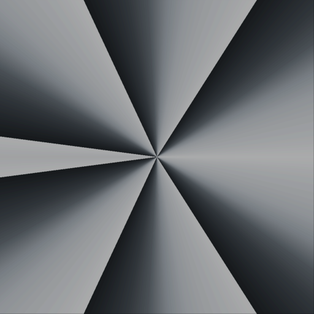

# Complex Function Visualisation

Some hints on visualizing a complex function using a palette.

```
z.real
```



```
z.imag
```


```
z.norm()
```


```
z.phase()
```



```
z = floor(z)
v = z1.real + z1.phase()
```


```
ln(z).real
```


